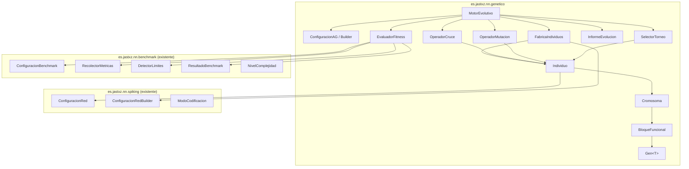
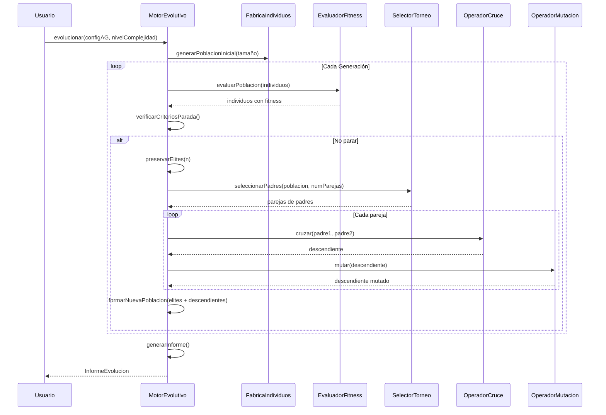
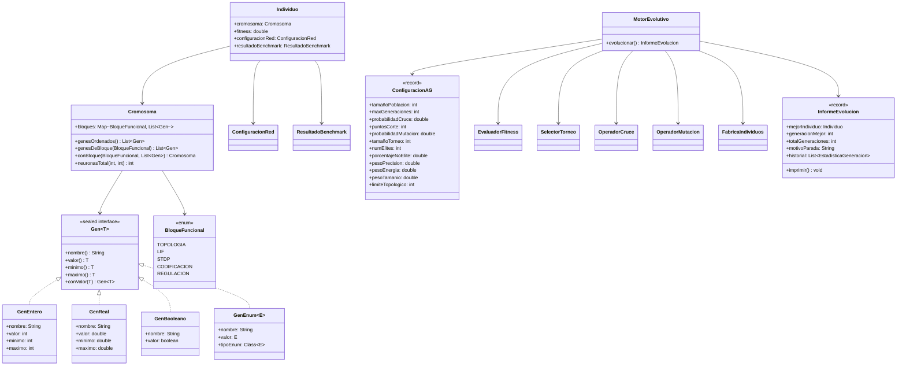

# Diseño: Algoritmo Genético para Optimización de Hiperparámetros de SNN

## Visión General

Este documento describe el diseño del módulo de Algoritmo Genético (AG) para la optimización automática de hiperparámetros de `RedNeuralSpiking`. El AG codifica cada individuo como un `ConfiguracionRed`, evalúa su fitness mediante el sistema de benchmark existente, y evoluciona la población mediante selección por torneo, cruce multi-punto por bloques funcionales y mutación adaptativa por tipo de gen.

El módulo se implementará en un nuevo paquete `es.jastxz.nn.genetico` que depende de los paquetes `spiking` y `benchmark` existentes, sin modificarlos.

### Decisiones de Diseño Clave

1. **Cromosoma como wrapper de genes tipados**: En lugar de un array plano de doubles, cada gen tiene tipo (entero, real, booleano, enumerado) y rango, lo que permite mutación adaptativa y validación en origen.
2. **Bloques funcionales para cruce**: Los genes se agrupan en 5 bloques (topología, LIF, STDP, codificación, regulación) que se mantienen íntegros durante el cruce para preservar coherencia funcional.
3. **Reparación sobre descarte**: Cuando un operador genera un individuo que viola el límite topológico, se repara proporcionalmente en lugar de descartarlo, evitando desperdicio computacional.
4. **Evaluación delegada al benchmark**: El fitness se calcula reutilizando `RecolectorMetricas` y `DetectorLimites`, manteniendo consistencia con el sistema existente.
5. **Inmutabilidad de individuos**: Los individuos son inmutables; los operadores genéticos siempre producen nuevas instancias.

## Arquitectura

### Diagrama de Componentes



### Flujo del Ciclo Evolutivo



## Componentes e Interfaces

### 1. `Gen<T>` — Unidad mínima del cromosoma

Representa un hiperparámetro individual con su tipo, valor actual y rango válido.

```java
public sealed interface Gen<T> {

    String nombre();
    T valor();
    T minimo();
    T maximo();
    Gen<T> conValor(T nuevoValor);

    record GenEntero(String nombre, int valor, int minimo, int maximo)
            implements Gen<Integer> {
        public GenEntero {
            if (valor < minimo || valor > maximo)
                throw new IllegalArgumentException(
                    nombre + ": " + valor + " fuera de [" + minimo + ", " + maximo + "]");
        }
        @Override public Integer valor()  { return valor; }
        @Override public Integer minimo() { return minimo; }
        @Override public Integer maximo() { return maximo; }
        @Override public Gen<Integer> conValor(Integer v) {
            return new GenEntero(nombre, Math.clamp(v, minimo, maximo), minimo, maximo);
        }
    }

    record GenReal(String nombre, double valor, double minimo, double maximo)
            implements Gen<Double> {
        public GenReal {
            if (valor < minimo || valor > maximo)
                throw new IllegalArgumentException(
                    nombre + ": " + valor + " fuera de [" + minimo + ", " + maximo + "]");
        }
        @Override public Double valor()  { return valor; }
        @Override public Double minimo() { return minimo; }
        @Override public Double maximo() { return maximo; }
        @Override public Gen<Double> conValor(Double v) {
            return new GenReal(nombre, Math.clamp(v, minimo, maximo), minimo, maximo);
        }
    }

    record GenBooleano(String nombre, boolean valor)
            implements Gen<Boolean> {
        @Override public Boolean valor()  { return valor; }
        @Override public Boolean minimo() { return false; }
        @Override public Boolean maximo() { return true; }
        @Override public Gen<Boolean> conValor(Boolean v) {
            return new GenBooleano(nombre, v);
        }
    }

    record GenEnum<E extends Enum<E>>(String nombre, E valor, Class<E> tipoEnum)
            implements Gen<E> {
        @Override public E minimo() { return tipoEnum.getEnumConstants()[0]; }
        @Override public E maximo() {
            E[] vals = tipoEnum.getEnumConstants();
            return vals[vals.length - 1];
        }
        @Override public Gen<E> conValor(E v) {
            return new GenEnum<>(nombre, v, tipoEnum);
        }
    }
}
```

### 2. `BloqueFuncional` — Agrupación de genes dependientes

```java
public enum BloqueFuncional {
    TOPOLOGIA,      // capasOcultas, neuronasPorCapa[]
    LIF,            // umbralDisparo, potencialReposo, constanteDecaimiento, duracionRefractario
    STDP,           // amplitudLTP, amplitudLTD, tauLTP, tauLTD
    CODIFICACION,   // frecuenciaMaxima, modoCodificacion, ventanaDecodificacion
    REGULACION      // homeostasisActiva, tasaDisparoObjetivo, tasaAjusteHomeostasis,
                    // inhibicionLateralActiva, radioInhibicion, fuerzaInhibicion
}
```

### 3. `Cromosoma` — Colección ordenada de genes agrupados por bloque

```java
public record Cromosoma(Map<BloqueFuncional, List<Gen<?>>> bloques) {

    /** Retorna todos los genes en orden de bloque (TOPOLOGIA → LIF → STDP → CODIFICACION → REGULACION). */
    public List<Gen<?>> genesOrdenados() { ... }

    /** Retorna los genes de un bloque específico. */
    public List<Gen<?>> genesDeBloque(BloqueFuncional bloque) { ... }

    /** Crea un nuevo Cromosoma reemplazando un bloque completo. */
    public Cromosoma conBloque(BloqueFuncional bloque, List<Gen<?>> genes) { ... }

    /** Calcula el número total de neuronas (entrada + ocultas + salida). */
    public int neuronasTotal(int entrada, int salida) { ... }
}
```

### 4. `Individuo` — Unidad de la población

```java
public record Individuo(
    Cromosoma cromosoma,
    double fitness,
    ConfiguracionRed configuracionRed,
    ResultadoBenchmark resultadoBenchmark
) implements Comparable<Individuo> {

    /** Crea un individuo sin evaluar (fitness = -1). */
    public static Individuo sinEvaluar(Cromosoma cromosoma, ConfiguracionRed config) { ... }

    /** Crea un individuo evaluado con su fitness y resultado de benchmark. */
    public Individuo conEvaluacion(double fitness, ResultadoBenchmark resultado) { ... }

    @Override
    public int compareTo(Individuo otro) {
        return Double.compare(otro.fitness, this.fitness); // Mayor fitness primero
    }
}
```

### 5. `FabricaIndividuos` — Creación y conversión de individuos

Responsable de generar individuos aleatorios válidos y convertir cromosomas a `ConfiguracionRed`.

```java
public class FabricaIndividuos {

    private final int dimensionEntrada;
    private final int dimensionSalida;
    private final int limiteTopologico;
    private final Random random;

    /**
     * Genera un individuo aleatorio con genes dentro de los rangos definidos.
     * Garantiza: umbralDisparo > potencialReposo y neuronasTotal <= limiteTopologico.
     */
    public Individuo generarAleatorio() { ... }

    /**
     * Convierte un Cromosoma a ConfiguracionRed usando ConfiguracionRedBuilder.
     * @throws IllegalArgumentException si la configuración resultante es inválida
     */
    public ConfiguracionRed construirConfiguracion(Cromosoma cromosoma) { ... }

    /**
     * Repara un cromosoma que excede el límite topológico reduciendo
     * proporcionalmente las neuronas por capa oculta.
     * Algoritmo:
     *   1. Calcular neuronasOcultas = sum(neuronasPorCapa)
     *   2. maxOcultas = limiteTopologico - entrada - salida
     *   3. Si neuronasOcultas > maxOcultas:
     *      factor = maxOcultas / neuronasOcultas
     *      Para cada capa: nuevasNeuronas = max(1, round(neuronas * factor))
     *   4. Ajustar última capa si la suma aún excede el límite
     */
    public Cromosoma repararTopologia(Cromosoma cromosoma) { ... }
}
```

### 6. `EvaluadorFitness` — Cálculo de fitness multi-objetivo

```java
public class EvaluadorFitness {

    private final NivelComplejidad nivel;
    private final RecolectorMetricas recolector;
    private final double pesoPrecision;     // default 0.5
    private final double pesoEnergia;       // default 0.3
    private final double pesoTamanio;       // default 0.2
    private final int limiteTopologico;
    private final int epocasBenchmark;
    private final int repeticionesBenchmark;
    private final long semilla;

    /**
     * Evalúa un individuo ejecutando benchmark y calculando fitness ponderado.
     *
     * Algoritmo:
     *   1. Construir ConfiguracionBenchmark con la topología del individuo
     *   2. Ejecutar RecolectorMetricas.ejecutarYRecolectar()
     *   3. Clasificar con DetectorLimites.clasificar()
     *   4. Si clasificación es "timeout" o "limite_no_superado" → fitness = 0.0
     *   5. Normalizar componentes:
     *      - precision_norm = precisionFinal (ya en [0,1])
     *      - energia_norm = 1.0 - min(1.0, costoEnergetico / costoMaxReferencia)
     *      - tamanio_norm = 1.0 - (neuronasTotal / limiteTopologico)
     *   6. fitness = pesoPrecision * precision_norm
     *              + pesoEnergia * energia_norm
     *              + pesoTamanio * tamanio_norm
     *
     * Si la construcción o entrenamiento lanza excepción → fitness = 0.0
     */
    public Individuo evaluar(Individuo individuo) { ... }

    /** Evalúa toda la población. */
    public List<Individuo> evaluarPoblacion(List<Individuo> poblacion) { ... }
}
```

### 7. `SelectorTorneo` — Selección de padres con diversidad garantizada

```java
public class SelectorTorneo {

    private final int tamañoTorneo;       // default 3
    private final int numElites;          // default 2
    private final double porcentajeNoElite; // default 0.15
    private final Random random;

    /**
     * Selecciona parejas de padres para cruce.
     *
     * Algoritmo:
     *   1. Ordenar población por fitness descendente
     *   2. Identificar élites = primeros numElites individuos
     *   3. Calcular numParejas = (tamañoPoblacion - numElites) / 2
     *   4. Calcular parejasNoElite = ceil(numParejas * porcentajeNoElite)
     *   5. Para parejasNoElite parejas:
     *      - Seleccionar ambos padres del subconjunto no-élite aleatoriamente
     *      - Garantizar que padre1 != padre2
     *   6. Para parejas restantes:
     *      - Ejecutar torneo de tamaño k para cada padre
     *      - Si padre1 == padre2, repetir torneo para padre2
     *   7. Retornar lista de parejas
     */
    public List<Pareja> seleccionarParejas(List<Individuo> poblacion) { ... }

    /**
     * Ejecuta un torneo: selecciona k individuos aleatorios y retorna el de mayor fitness.
     */
    private Individuo ejecutarTorneo(List<Individuo> poblacion) { ... }

    public record Pareja(Individuo padre1, Individuo padre2) {
        /** Retorna el padre con mayor fitness. */
        public Individuo mejorPadre() { ... }
        /** Retorna el padre con menor fitness. */
        public Individuo peorPadre() { ... }
    }
}
```

### 8. `OperadorCruce` — Cruce multi-punto por bloques funcionales

```java
public class OperadorCruce {

    private final double probabilidadCruce;  // default 0.8
    private final int puntosCorte;           // default 2
    private final int limiteTopologico;
    private final FabricaIndividuos fabrica;
    private final Random random;

    /**
     * Cruza dos padres produciendo un descendiente.
     *
     * Pseudocódigo:
     *   1. Si random.nextDouble() > probabilidadCruce → retornar copia del mejor padre
     *   2. bloques = [TOPOLOGIA, LIF, STDP, CODIFICACION, REGULACION]  (5 bloques)
     *   3. Generar X puntos de corte aleatorios entre posiciones [1, 4]
     *      (entre bloques, no dentro de bloques)
     *   4. Los puntos de corte dividen los 5 bloques en (X+1) segmentos
     *   5. Determinar mejorPadre y peorPadre por fitness
     *   6. Seleccionar Y segmentos del mejorPadre donde Y > (X+1)/2
     *      - Seleccionar ceil((X+1+1)/2) segmentos aleatorios para el mejor padre
     *   7. Los segmentos restantes se toman del peorPadre
     *   8. Ensamblar cromosoma descendiente con los bloques seleccionados
     *   9. Si bloque TOPOLOGIA viene de un padre, usar su estructura completa
     *      (número de capas y neuronas por capa)
     *  10. Reparar topología si excede límite
     *  11. Construir ConfiguracionRed y validar
     *  12. Retornar nuevo Individuo sin evaluar
     */
    public Individuo cruzar(Individuo padre1, Individuo padre2) { ... }
}
```

### 9. `OperadorMutacion` — Mutación adaptativa por tipo de gen

```java
public class OperadorMutacion {

    private final double probabilidadMutacion; // default 0.1 por gen
    private final int limiteTopologico;
    private final FabricaIndividuos fabrica;
    private final Random random;

    /**
     * Muta un individuo aplicando perturbaciones por tipo de gen.
     *
     * Pseudocódigo:
     *   1. Para cada gen del cromosoma:
     *      a. Si random.nextDouble() > probabilidadMutacion → mantener gen
     *      b. Según tipo de gen:
     *         - GenEntero: delta = random(1, ceil(0.20 * rango))
     *                      nuevoValor = valor ± delta (aleatorio)
     *                      clamp(nuevoValor, min, max)
     *         - GenReal:   sigma = 0.10 * (max - min)
     *                      nuevoValor = valor + random.nextGaussian() * sigma
     *                      clamp(nuevoValor, min, max)
     *         - GenBooleano: nuevoValor = !valor
     *         - GenEnum:   nuevoValor = valores[random.nextInt(numValores)]
     *   2. Tratamiento especial para gen "capasOcultas":
     *      - Si nuevasCapas > capasAnteriores:
     *        Añadir (nuevasCapas - capasAnteriores) capas con neuronas aleatorias en [1, 512]
     *      - Si nuevasCapas < capasAnteriores:
     *        Eliminar las últimas (capasAnteriores - nuevasCapas) capas
     *   3. Validar restricción umbralDisparo > potencialReposo:
     *      Si se viola, ajustar umbralDisparo = potencialReposo + 1.0
     *   4. Reparar topología si excede límite
     *   5. Construir ConfiguracionRed y retornar nuevo Individuo sin evaluar
     */
    public Individuo mutar(Individuo individuo) { ... }
}
```

### 10. `ConfiguracionAG` / `ConfiguracionAGBuilder` — Configuración del AG

```java
public record ConfiguracionAG(
    int tamañoPoblacion,           // default 30
    int maxGeneraciones,           // default 50
    int generacionesEstancamiento, // default 10
    double probabilidadCruce,      // default 0.8
    int puntosCorte,               // default 2
    double probabilidadMutacion,   // default 0.1
    int tamañoTorneo,              // default 3
    int numElites,                 // default 2
    double porcentajeNoElite,      // default 0.15
    double pesoPrecision,          // default 0.5
    double pesoEnergia,            // default 0.3
    double pesoTamanio,            // default 0.2
    int limiteTopologico,          // default 512
    int epocasBenchmark,           // default 10
    int repeticionesBenchmark,     // default 1
    long semilla                   // default System.nanoTime()
) {
    public ConfiguracionAG {
        // Validaciones:
        // - pesoPrecision + pesoEnergia + pesoTamanio == 1.0 (tolerancia 1e-6)
        // - tamañoTorneo <= tamañoPoblacion
        // - puntosCorte en [1, 4] (5 bloques - 1)
        // - numElites < tamañoPoblacion
        // - porcentajeNoElite en [0.0, 1.0]
        // - limiteTopologico > 0
    }
}

public class ConfiguracionAGBuilder {
    // Todos los campos con valores por defecto
    // Métodos fluidos para cada parámetro
    // build() retorna ConfiguracionAG validada
    public ConfiguracionAGBuilder tamañoPoblacion(int v) { ... }
    public ConfiguracionAGBuilder maxGeneraciones(int v) { ... }
    public ConfiguracionAGBuilder generacionesEstancamiento(int v) { ... }
    public ConfiguracionAGBuilder probabilidadCruce(double v) { ... }
    public ConfiguracionAGBuilder puntosCorte(int v) { ... }
    public ConfiguracionAGBuilder probabilidadMutacion(double v) { ... }
    public ConfiguracionAGBuilder tamañoTorneo(int v) { ... }
    public ConfiguracionAGBuilder numElites(int v) { ... }
    public ConfiguracionAGBuilder porcentajeNoElite(double v) { ... }
    public ConfiguracionAGBuilder pesosFitness(double precision, double energia, double tamanio) { ... }
    public ConfiguracionAGBuilder limiteTopologico(int v) { ... }
    public ConfiguracionAGBuilder epocasBenchmark(int v) { ... }
    public ConfiguracionAGBuilder repeticionesBenchmark(int v) { ... }
    public ConfiguracionAGBuilder semilla(long v) { ... }
    public ConfiguracionAG build() { ... }
}
```

### 11. `MotorEvolutivo` — Orquestador del ciclo evolutivo

```java
public class MotorEvolutivo {

    private final ConfiguracionAG config;
    private final NivelComplejidad nivel;
    private final EvaluadorFitness evaluador;
    private final SelectorTorneo selector;
    private final OperadorCruce cruce;
    private final OperadorMutacion mutacion;
    private final FabricaIndividuos fabrica;

    public MotorEvolutivo(ConfiguracionAG config, NivelComplejidad nivel) { ... }

    /**
     * Ejecuta el ciclo evolutivo completo.
     *
     * Pseudocódigo:
     *   1. poblacion = fabrica.generarPoblacionInicial(tamañoPoblacion)
     *   2. poblacion = evaluador.evaluarPoblacion(poblacion)
     *   3. mejorGlobal = mejor de poblacion
     *   4. generacionesSinMejora = 0
     *   5. Para gen = 0 hasta maxGeneraciones:
     *      a. Ordenar poblacion por fitness descendente
     *      b. elites = poblacion[0..numElites]
     *      c. parejas = selector.seleccionarParejas(poblacion)
     *      d. descendientes = []
     *      e. Para cada pareja:
     *         - hijo = cruce.cruzar(pareja.padre1, pareja.padre2)
     *         - hijo = mutacion.mutar(hijo)
     *         - descendientes.add(hijo)
     *      f. nuevaPoblacion = elites + descendientes
     *      g. nuevaPoblacion = evaluador.evaluarPoblacion(nuevaPoblacion)
     *      h. Si mejor de nuevaPoblacion > mejorGlobal * 1.01:
     *         - mejorGlobal = mejor de nuevaPoblacion
     *         - generacionesSinMejora = 0
     *         Sino: generacionesSinMejora++
     *      i. Registrar estadísticas de generación
     *      j. Si generacionesSinMejora >= generacionesEstancamiento → parar
     *      k. poblacion = nuevaPoblacion
     *   6. Retornar InformeEvolucion con mejorGlobal y estadísticas
     */
    public InformeEvolucion evolucionar() { ... }
}
```

### 12. `InformeEvolucion` — Resultado del proceso evolutivo

```java
public record InformeEvolucion(
    Individuo mejorIndividuo,
    int generacionMejor,
    int totalGeneraciones,
    String motivoParada,           // "max_generaciones" | "estancamiento"
    List<EstadisticaGeneracion> historial,
    ConfiguracionAG configuracionAG
) {
    /** Imprime el informe por System.out. */
    public void imprimir() { ... }
}

public record EstadisticaGeneracion(
    int numero,
    double mejorFitness,
    double fitnessPromedio,
    double peorFitness,
    ConfiguracionRed mejorConfiguracion
) {}
```

## Modelos de Datos

### Definición de Genes por Bloque Funcional

| Bloque | Gen | Tipo | Rango | Valor por defecto |
|--------|-----|------|-------|-------------------|
| **TOPOLOGIA** | capasOcultas | Entero | [1, 10] | 3 |
| **TOPOLOGIA** | neuronasPorCapa[i] | Entero | [1, 512] | 32 |
| **LIF** | umbralDisparo | Real | [-60.0, -40.0] mV | -55.0 |
| **LIF** | potencialReposo | Real | [-80.0, -60.0] mV | -70.0 |
| **LIF** | constanteDecaimiento | Real | [5.0, 50.0] ms | 20.0 |
| **LIF** | duracionRefractario | Entero | [1, 10] ts | 2 |
| **STDP** | amplitudLTP | Real | [0.001, 0.1] | 0.01 |
| **STDP** | amplitudLTD | Real | [0.001, 0.1] | 0.012 |
| **STDP** | tauLTP | Real | [5.0, 50.0] ms | 20.0 |
| **STDP** | tauLTD | Real | [5.0, 50.0] ms | 20.0 |
| **CODIFICACION** | frecuenciaMaxima | Real | [10.0, 500.0] Hz | 100.0 |
| **CODIFICACION** | modoCodificacion | Enum | {POISSON, REGULAR, BURST} | POISSON |
| **CODIFICACION** | ventanaDecodificacion | Entero | [10, 200] ts | 50 |
| **REGULACION** | homeostasisActiva | Booleano | {true, false} | true |
| **REGULACION** | tasaDisparoObjetivo | Real | [1.0, 50.0] Hz | 10.0 |
| **REGULACION** | tasaAjusteHomeostasis | Real | [0.001, 0.1] | 0.01 |
| **REGULACION** | inhibicionLateralActiva | Booleano | {true, false} | false |
| **REGULACION** | radioInhibicion | Entero | [1, 5] | 2 |
| **REGULACION** | fuerzaInhibicion | Real | [0.1, 2.0] | 0.5 |

### Restricciones Inter-Gen

1. **umbralDisparo > potencialReposo**: Siempre. Si se viola tras mutación, ajustar umbralDisparo = potencialReposo + 1.0 mV.
2. **neuronasTotal ≤ limiteTopologico**: `entrada + sum(neuronasPorCapa[0..capasOcultas-1]) + salida ≤ 512`. Si se viola, reparación proporcional.
3. **Genes condicionales**: `tasaDisparoObjetivo` y `tasaAjusteHomeostasis` solo son relevantes si `homeostasisActiva = true`. `radioInhibicion` y `fuerzaInhibicion` solo si `inhibicionLateralActiva = true`. Sin embargo, siempre se codifican en el cromosoma para simplificar operadores.

### Mapeo Cromosoma → ConfiguracionRed

```java
// Pseudocódigo de FabricaIndividuos.construirConfiguracion(cromosoma)
ConfiguracionRed config = new ConfiguracionRedBuilder()
    .topologia(entrada, neuronasPorCapa[0], ..., neuronasPorCapa[n-1], salida)
    .parametrosLIF(umbralDisparo, potencialReposo, constanteDecaimiento, duracionRefractario)
    .parametrosSTDP(amplitudLTP, amplitudLTD, tauLTP, tauLTD)
    .parametrosCodificacion(frecuenciaMaxima, modoCodificacion, ventanaDecodificacion)
    .homeostasis(homeostasisActiva, tasaDisparoObjetivo, tasaAjusteHomeostasis)
    .inhibicionLateral(inhibicionLateralActiva, radioInhibicion, fuerzaInhibicion)
    // Parámetros fijos (no optimizados por el AG):
    .inicializacionPesos(TipoInicializacion.UNIFORME, 0.3, 3.0)
    .parametrosNormalizacion(TipoNormalizacion.L2, 1.0)
    .retardos(1, 1)
    .duracionTimestep(1.0)
    .build();
```

### Diagrama de Clases



## Propiedades de Corrección

*Una propiedad es una característica o comportamiento que debe cumplirse en todas las ejecuciones válidas de un sistema — esencialmente, una declaración formal sobre lo que el sistema debe hacer. Las propiedades sirven como puente entre especificaciones legibles por humanos y garantías de corrección verificables por máquina.*

### Propiedad 1: Genes dentro de rangos válidos

*Para cualquier* individuo producido por el AG (ya sea por generación aleatoria, cruce o mutación), todos los genes del cromosoma deben estar dentro de sus rangos definidos: capasOcultas en [1,10], neuronasPorCapa en [1,512], umbralDisparo en [-60.0,-40.0], potencialReposo en [-80.0,-60.0], constanteDecaimiento en [5.0,50.0], duracionRefractario en [1,10], amplitudLTP en [0.001,0.1], amplitudLTD en [0.001,0.1], tauLTP en [5.0,50.0], tauLTD en [5.0,50.0], frecuenciaMaxima en [10.0,500.0], modoCodificacion en {POISSON,REGULAR,BURST}, ventanaDecodificacion en [10,200], homeostasisActiva en {true,false}, tasaDisparoObjetivo en [1.0,50.0], tasaAjusteHomeostasis en [0.001,0.1], inhibicionLateralActiva en {true,false}, radioInhibicion en [1,5], fuerzaInhibicion en [0.1,2.0].

**Valida: Requisitos 1.1, 1.2, 1.3, 1.4, 1.5, 6.8**

### Propiedad 2: Restricción umbralDisparo > potencialReposo

*Para cualquier* individuo producido por el AG (generación, cruce o mutación), el valor del gen umbralDisparo debe ser estrictamente mayor que el valor del gen potencialReposo.

**Valida: Requisito 1.6**

### Propiedad 3: ConfiguracionRed válida

*Para cualquier* individuo producido por el AG, la construcción de ConfiguracionRed mediante ConfiguracionRedBuilder con los valores del cromosoma no debe lanzar IllegalArgumentException.

**Valida: Requisitos 1.7, 5.6**

### Propiedad 4: Límite topológico respetado

*Para cualquier* individuo presente en la población en cualquier momento del ciclo evolutivo (generación inicial, después de cruce, después de mutación), el número total de neuronas (entrada + ocultas + salida) no debe exceder el límite topológico configurado (512 por defecto).

**Valida: Requisitos 2.1, 2.2, 5.6**

### Propiedad 5: Reparación proporcional preserva el límite

*Para cualquier* cromosoma cuyo número total de neuronas excede el límite topológico, después de aplicar la reparación proporcional, el número total de neuronas debe ser menor o igual al límite topológico, cada capa oculta debe tener al menos 1 neurona, y las proporciones relativas entre capas deben mantenerse aproximadamente (ratio original ± 1 neurona por redondeo).

**Valida: Requisito 2.3**

### Propiedad 6: Fitness como combinación ponderada normalizada

*Para cualquier* individuo con un ResultadoBenchmark válido (clasificación distinta de "timeout" y "limite_no_superado"), el fitness debe ser igual a `pesoPrecision * precisionNorm + pesoEnergia * energiaNorm + pesoTamanio * tamanioNorm`, donde cada componente normalizado está en [0.0, 1.0] y tamanioNorm = 1.0 - (neuronasTotal / limiteTopologico).

**Valida: Requisitos 3.2, 3.3, 3.4**

### Propiedad 7: Fitness cero para benchmarks fallidos

*Para cualquier* individuo cuyo ResultadoBenchmark tiene clasificación "timeout" o "limite_no_superado", o cuya evaluación lanza una excepción, el fitness asignado debe ser exactamente 0.0.

**Valida: Requisitos 3.5, 9.4**

### Propiedad 8: Ganador del torneo es el mejor de los k seleccionados

*Para cualquier* ejecución de torneo con k individuos seleccionados aleatoriamente de la población, el individuo retornado como ganador debe tener un fitness mayor o igual al de todos los demás individuos del torneo.

**Valida: Requisitos 4.1, 4.2**

### Propiedad 9: Padres siempre distintos

*Para cualquier* pareja de padres seleccionada para cruce, padre1 y padre2 deben ser individuos distintos (diferente cromosoma).

**Valida: Requisito 4.3**

### Propiedad 10: Preservación de élites

*Para cualquier* transición entre generaciones, los N mejores individuos de la generación anterior (por fitness) deben estar presentes sin modificación en la nueva generación.

**Valida: Requisito 4.4**

### Propiedad 11: Diversidad mínima de padres no-élite

*Para cualquier* generación, al menos el 15% de los padres seleccionados deben provenir de individuos que no están entre los N mejores (no-élite) de la población.

**Valida: Requisito 4.5**

### Propiedad 12: Integridad de bloques funcionales en cruce

*Para cualquier* descendiente producido por cruce, cada bloque funcional (TOPOLOGIA, LIF, STDP, CODIFICACION, REGULACION) debe provenir íntegramente de uno de los dos padres, sin mezclar genes de diferentes padres dentro del mismo bloque.

**Valida: Requisitos 5.1, 5.2, 5.4, 5.5**

### Propiedad 13: Sesgo hacia el mejor padre en cruce

*Para cualquier* cruce entre dos padres con fitness distintos, el número de bloques funcionales tomados del padre con mayor fitness debe ser estrictamente mayor que la mitad del número total de bloques.

**Valida: Requisito 5.3**

### Propiedad 14: Mutación con probabilidad cero no modifica

*Para cualquier* individuo, aplicar mutación con probabilidad 0.0 debe retornar un individuo con cromosoma idéntico al original.

**Valida: Requisito 6.1**

### Propiedad 15: Mutación respeta estrategia por tipo de gen

*Para cualquier* gen mutado: si es entero, el cambio absoluto está en [1, ceil(0.20 * rango)]; si es booleano, el valor se invierte; si es enumerado, el nuevo valor es un valor válido del enum; si es real, el resultado está dentro de los límites del gen.

**Valida: Requisitos 6.2, 6.3, 6.4, 6.5**

### Propiedad 16: Mutación de capas mantiene coherencia topológica

*Para cualquier* mutación del gen capasOcultas: si el nuevo valor es mayor, las capas adicionales tienen neuronas en [1, 512]; si es menor, las capas restantes conservan los valores de las primeras capas originales.

**Valida: Requisitos 6.6, 6.7**

### Propiedad 17: Criterios de parada respetados

*Para cualquier* ejecución del AG, el número total de generaciones no debe exceder maxGeneraciones, y si el motivo de parada es "estancamiento", el mejor fitness no mejoró más de un 1% durante las últimas generacionesEstancamiento generaciones consecutivas.

**Valida: Requisitos 7.2, 7.3**

### Propiedad 18: Mejor global es el mejor de toda la evolución

*Para cualquier* ejecución del AG, el fitness del individuo retornado como mejor global debe ser mayor o igual al mejor fitness registrado en cada generación del historial.

**Valida: Requisito 7.5**

### Propiedad 19: Reproducibilidad con semilla

*Para cualquier* semilla y configuración del AG, dos ejecuciones con la misma semilla y configuración deben producir el mismo individuo mejor (mismo cromosoma y fitness).

**Valida: Requisito 7.7**

### Propiedad 20: Validación de ConfiguracionAG

*Para cualquier* tripleta de pesos (p1, p2, p3) donde |p1 + p2 + p3 - 1.0| > 1e-6, construir ConfiguracionAG debe lanzar IllegalArgumentException. Igualmente, para cualquier tamañoTorneo > tamañoPoblacion.

**Valida: Requisitos 8.3, 8.4**

### Propiedad 21: Informe completo

*Para cualquier* ejecución completada del AG, el InformeEvolucion debe contener: el mejor individuo con fitness > -1, el número de generación donde se encontró, el motivo de parada ("max_generaciones" o "estancamiento"), un historial con una entrada por generación ejecutada, y la ConfiguracionAG utilizada.

**Valida: Requisitos 10.1, 10.2, 10.3, 10.5**

## Manejo de Errores

### Errores de Configuración (Fail-Fast)

| Situación | Componente | Acción |
|-----------|-----------|--------|
| Pesos de fitness no suman 1.0 | `ConfiguracionAGBuilder.build()` | Lanzar `IllegalArgumentException` |
| Tamaño de torneo > tamaño de población | `ConfiguracionAGBuilder.build()` | Lanzar `IllegalArgumentException` |
| Puntos de corte fuera de [1, 4] | `ConfiguracionAGBuilder.build()` | Lanzar `IllegalArgumentException` |
| Número de élites ≥ tamaño de población | `ConfiguracionAGBuilder.build()` | Lanzar `IllegalArgumentException` |
| Límite topológico ≤ 0 | `ConfiguracionAGBuilder.build()` | Lanzar `IllegalArgumentException` |
| Gen fuera de rango en construcción | `Gen.constructor` | Lanzar `IllegalArgumentException` |

### Errores de Evaluación (Tolerantes)

| Situación | Componente | Acción |
|-----------|-----------|--------|
| Excepción al construir `ConfiguracionRed` | `EvaluadorFitness.evaluar()` | Fitness = 0.0, registrar excepción, continuar |
| Excepción durante entrenamiento (NaN, Infinity) | `EvaluadorFitness.evaluar()` | Fitness = 0.0, registrar excepción, continuar |
| Benchmark retorna "timeout" | `EvaluadorFitness.evaluar()` | Fitness = 0.0 |
| Benchmark retorna "limite_no_superado" | `EvaluadorFitness.evaluar()` | Fitness = 0.0 |

### Errores de Operadores Genéticos (Reparación)

| Situación | Componente | Acción |
|-----------|-----------|--------|
| Cruce produce individuo que excede límite topológico | `OperadorCruce.cruzar()` | Reparación proporcional via `FabricaIndividuos.repararTopologia()` |
| Mutación produce individuo que excede límite topológico | `OperadorMutacion.mutar()` | Reparación proporcional via `FabricaIndividuos.repararTopologia()` |
| Mutación viola umbralDisparo > potencialReposo | `OperadorMutacion.mutar()` | Ajustar umbralDisparo = potencialReposo + 1.0 |
| Gen mutado fuera de rango | `OperadorMutacion.mutar()` | Clamping al rango válido via `Gen.conValor()` |

## Estrategia de Testing

### Enfoque Dual: Tests Unitarios + Tests de Propiedades

El testing combina dos enfoques complementarios:

1. **Tests unitarios (JUnit 5)**: Verifican ejemplos específicos, casos borde y condiciones de error.
2. **Tests de propiedades (jqwik)**: Verifican propiedades universales con entradas generadas aleatoriamente, mínimo 100 iteraciones por propiedad.

### Librería de Property-Based Testing

Se usará **jqwik 1.7.4** (ya presente en `pom.xml`) como librería de property-based testing para Java.

### Configuración de Tests de Propiedades

- Cada test de propiedad debe ejecutar un mínimo de **100 iteraciones** (`@Property(tries = 100)`)
- Cada test debe incluir un comentario de trazabilidad con formato:
  `// Feature: genetic-algorithm-hyperparameters, Property N: [título de la propiedad]`
- Cada propiedad de corrección debe ser implementada por un **único** test de propiedad

### Generadores Personalizados (Arbitraries)

Se necesitan generadores jqwik personalizados para:

- **`Arbitrary<Cromosoma>`**: Genera cromosomas con genes aleatorios dentro de rangos válidos, respetando restricciones inter-gen (umbralDisparo > potencialReposo, límite topológico).
- **`Arbitrary<Individuo>`**: Genera individuos con cromosomas válidos y fitness aleatorio.
- **`Arbitrary<ConfiguracionAG>`**: Genera configuraciones válidas del AG con parámetros aleatorios dentro de rangos razonables.
- **`Arbitrary<List<Individuo>>`**: Genera poblaciones de tamaño variable con individuos evaluados.

### Plan de Tests Unitarios

| Componente | Tests Unitarios |
|-----------|----------------|
| `Gen` (todos los tipos) | Construcción válida, construcción fuera de rango, `conValor` con clamping |
| `Cromosoma` | Acceso por bloque, `neuronasTotal`, `conBloque` |
| `FabricaIndividuos` | Generación aleatoria produce individuo válido, reparación topológica con caso conocido |
| `EvaluadorFitness` | Cálculo de fitness con valores conocidos, fitness 0.0 para benchmark fallido |
| `SelectorTorneo` | Torneo con k=1 retorna aleatorio, torneo con k=N retorna el mejor |
| `OperadorCruce` | Cruce con probabilidad 0 retorna mejor padre, cruce con 1 punto de corte |
| `OperadorMutacion` | Mutación con probabilidad 0 no modifica, mutación de capas (añadir/eliminar) |
| `ConfiguracionAGBuilder` | Valores por defecto, validación de pesos, validación de torneo |
| `MotorEvolutivo` | Evolución con 1 generación, parada por estancamiento |
| `InformeEvolucion` | `imprimir()` produce salida no vacía |

### Plan de Tests de Propiedades

| Propiedad | Test jqwik | Generador Principal |
|-----------|-----------|-------------------|
| P1: Genes dentro de rangos | `genesEnRangosValidos` | `Arbitrary<Cromosoma>` + operadores |
| P2: umbralDisparo > potencialReposo | `umbralMayorQueReposo` | `Arbitrary<Individuo>` |
| P3: ConfiguracionRed válida | `configuracionRedValida` | `Arbitrary<Individuo>` |
| P4: Límite topológico | `limiteTopologicoRespetado` | `Arbitrary<Individuo>` + operadores |
| P5: Reparación proporcional | `reparacionProporcional` | `Arbitrary<Cromosoma>` excediendo límite |
| P6: Fitness ponderado | `fitnessCombinacionPonderada` | `Arbitrary<ResultadoBenchmark>` + pesos |
| P7: Fitness cero para fallidos | `fitnessCeroParaFallidos` | `Arbitrary<ResultadoBenchmark>` con clasificación |
| P8: Ganador del torneo | `ganadorTorneoEsMejor` | `Arbitrary<List<Individuo>>` + k |
| P9: Padres distintos | `padresDistintos` | `Arbitrary<List<Individuo>>` |
| P10: Preservación de élites | `elitesPreservadas` | `Arbitrary<List<Individuo>>` |
| P11: Diversidad no-élite | `diversidadNoElite` | `Arbitrary<List<Individuo>>` |
| P12: Integridad de bloques | `integridadBloquesCruce` | `Arbitrary<Individuo>` × 2 |
| P13: Sesgo mejor padre | `sesgoMejorPadreCruce` | `Arbitrary<Individuo>` × 2 |
| P14: Mutación prob 0 | `mutacionProbCeroNoModifica` | `Arbitrary<Individuo>` |
| P15: Mutación por tipo | `mutacionRespetaTipoGen` | `Arbitrary<Individuo>` |
| P16: Mutación capas | `mutacionCapasCoherente` | `Arbitrary<Individuo>` |
| P17: Criterios de parada | `criteriosParadaRespetados` | Integración con `MotorEvolutivo` mock |
| P18: Mejor global | `mejorGlobalEsMejorHistorial` | Integración con `MotorEvolutivo` mock |
| P19: Reproducibilidad | `reproducibilidadConSemilla` | `Arbitrary<Long>` semilla |
| P20: Validación ConfiguracionAG | `validacionConfiguracionAG` | `Arbitrary<Double>` × 3 pesos |
| P21: Informe completo | `informeCompletoTieneCampos` | Integración con `MotorEvolutivo` mock |
