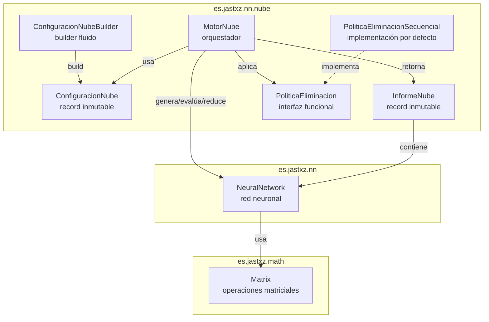
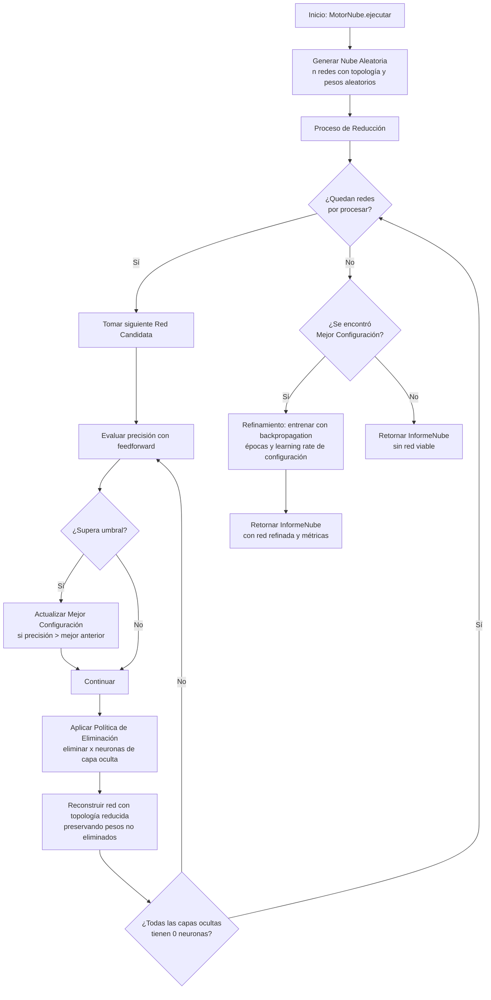
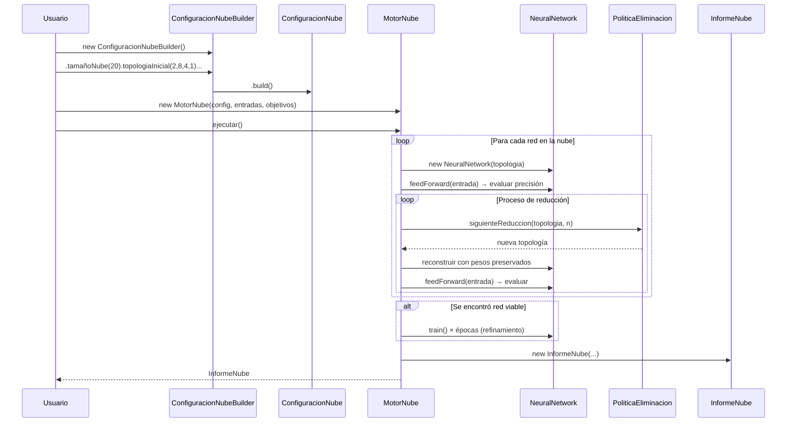

# Documento de Diseño: Método de la Nube Aleatoria

## Visión General

Este documento describe el diseño técnico para implementar el Método de la Nube Aleatoria dentro de la biblioteca `neural-lib`. El método es un algoritmo de búsqueda de arquitectura de redes neuronales que:

1. Genera una "nube" de redes neuronales con pesos aleatorios y topología predefinida.
2. Evalúa cada red contra un umbral de acierto.
3. Reduce progresivamente las neuronas de capas ocultas buscando la estructura mínima viable.
4. Refina la mejor red encontrada mediante backpropagation clásico.

El módulo se implementará en el paquete `es.jastxz.nn.nube`, siguiendo los patrones arquitectónicos establecidos por el módulo genético (`es.jastxz.nn.genetico`): record inmutable para configuración, builder con valores por defecto, motor orquestador, e informe de resultados.

### Decisiones de Diseño Clave

- **Java record para configuración**: Siguiendo `ConfiguracionAG`, se usará un `record` de Java para `ConfiguracionNube`, garantizando inmutabilidad y validación en el constructor compacto.
- **Builder fluido**: `ConfiguracionNubeBuilder` proporcionará valores por defecto razonables, igual que `ConfiguracionAGBuilder`.
- **Reutilización de `NeuralNetwork`**: Las redes candidatas serán instancias directas de `NeuralNetwork`. Para la reducción de neuronas, se reconstruirá una nueva `NeuralNetwork` con topología reducida, copiando los pesos de las neuronas no eliminadas.
- **Política de eliminación como interfaz funcional**: Se define `PoliticaEliminacion` como interfaz funcional para permitir estrategias personalizadas, con una implementación por defecto (secuencial).
- **Semilla para reproducibilidad**: Todos los generadores de números aleatorios se inicializarán con la semilla de la configuración, usando un `Random` central que derive sub-semillas.

## Arquitectura



### Flujo del Algoritmo



## Componentes e Interfaces

### 1. `ConfiguracionNube` (record)

Record inmutable que agrupa todos los hiperparámetros del método.

```java
public record ConfiguracionNube(
    int tamañoNube,           // número de redes en la nube (≥ 1)
    int[] topologiaInicial,   // topología de cada red (≥ 3 capas)
    double umbralAcierto,     // umbral mínimo de acierto [0.0, 1.0]
    int neuronasEliminar,     // neuronas a eliminar por iteración (≥ 1)
    int epocasRefinamiento,   // épocas de backpropagation para refinamiento
    double tasaAprendizaje,   // learning rate para refinamiento
    long semilla              // semilla para reproducibilidad
) { ... }
```

Validaciones en el constructor compacto:
- `tamañoNube < 1` → `IllegalArgumentException`
- `topologiaInicial.length < 3` → `IllegalArgumentException`
- `umbralAcierto` fuera de `[0.0, 1.0]` → `IllegalArgumentException`
- `neuronasEliminar < 1` → `IllegalArgumentException`

### 2. `ConfiguracionNubeBuilder`

Builder fluido con valores por defecto:

| Parámetro | Valor por defecto |
|---|---|
| `tamañoNube` | 10 |
| `topologiaInicial` | `{2, 4, 1}` |
| `umbralAcierto` | 0.5 |
| `neuronasEliminar` | 1 |
| `epocasRefinamiento` | 1000 |
| `tasaAprendizaje` | 0.1 |
| `semilla` | `System.nanoTime()` |

### 3. `PoliticaEliminacion` (interfaz funcional)

```java
@FunctionalInterface
public interface PoliticaEliminacion {
    /**
     * Determina la siguiente topología reducida.
     *
     * @param topologiaActual topología actual de la red (incluye entrada y salida)
     * @param neuronasEliminar número de neuronas a eliminar
     * @return nueva topología con neuronas eliminadas, o null si no hay más reducciones posibles
     */
    int[] siguienteReduccion(int[] topologiaActual, int neuronasEliminar);
}
```

### 4. `PoliticaEliminacionSecuencial`

Implementación por defecto: elimina `x` neuronas comenzando por la última capa oculta. Cuando una capa llega a 0, avanza a la capa anterior.

### 5. `MotorNube`

Orquestador principal del método. Acepta:
- `ConfiguracionNube` con los hiperparámetros
- `double[][] entradas` y `double[][] objetivos` como datos de entrenamiento/evaluación
- Opcionalmente, una `PoliticaEliminacion` personalizada

Métodos principales:
```java
public class MotorNube {
    public MotorNube(ConfiguracionNube config, double[][] entradas, 
                     double[][] objetivos) { ... }
    
    public MotorNube(ConfiguracionNube config, double[][] entradas, 
                     double[][] objetivos, PoliticaEliminacion politica) { ... }
    
    public InformeNube ejecutar() { ... }
}
```

Responsabilidades internas:
- `generarNube()`: Crea `n` instancias de `NeuralNetwork` con la topología y pesos aleatorios, usando la semilla para reproducibilidad.
- `evaluar(NeuralNetwork red)`: Ejecuta feedforward sobre todos los datos y calcula precisión (predicciones correctas / total).
- `reconstruirRed(NeuralNetwork original, int[] nuevaTopologia)`: Crea una nueva `NeuralNetwork` con la topología reducida, copiando los pesos y biases de las neuronas no eliminadas de la red original.
- `ejecutarReduccion(NeuralNetwork red)`: Aplica iterativamente la política de eliminación, evaluando en cada paso.
- `refinar(NeuralNetwork red)`: Entrena la red con backpropagation durante las épocas configuradas.

### 6. `InformeNube` (record)

```java
public record InformeNube(
    NeuralNetwork mejorRed,        // null si ninguna superó el umbral
    double precision,               // precisión de la mejor red (0.0 si no hay)
    int[] topologiaFinal,          // topología de la mejor red
    int totalRedesEvaluadas,       // número total de redes procesadas
    int totalReducciones,          // número total de reducciones realizadas
    long tiempoEjecucionMs,        // tiempo total en milisegundos
    boolean exitoso                // true si se encontró red viable
) { ... }
```

## Modelos de Datos

### Flujo de datos entre componentes



### Estructura de datos interna

La reconstrucción de una red con topología reducida es la operación más delicada del diseño. Cuando se eliminan las últimas `x` neuronas de una capa oculta `k`:

1. **Matriz de pesos W[k-1]** (de capa k-1 a capa k): Se eliminan las últimas `x` filas (cada fila corresponde a una neurona de la capa destino).
2. **Matriz de biases B[k]**: Se eliminan las últimas `x` filas.
3. **Matriz de pesos W[k]** (de capa k a capa k+1): Se eliminan las últimas `x` columnas (cada columna corresponde a una neurona de la capa origen).

Esto se implementa creando nuevas matrices `Matrix` con las dimensiones reducidas y copiando los datos correspondientes del array `double[][]` subyacente.

### Acceso a internos de `NeuralNetwork`

Actualmente `NeuralNetwork` no expone getters para `weights`, `biases` ni `topology`. Para la reconstrucción de redes reducidas, se necesitará:

- Añadir métodos de acceso: `getTopology()`, `getWeights()`, `getBiases()` a `NeuralNetwork`.
- Alternativamente, añadir un constructor que acepte pesos y biases pre-existentes: `NeuralNetwork(int[] topology, List<Matrix> weights, List<Matrix> biases)`.

La opción recomendada es añadir ambos: getters para lectura y un constructor con pesos para reconstrucción. Esto es consistente con el principio de mínima modificación y permite que otros módulos también se beneficien.


## Propiedades de Corrección

*Una propiedad es una característica o comportamiento que debe cumplirse en todas las ejecuciones válidas de un sistema — esencialmente, una declaración formal sobre lo que el sistema debe hacer. Las propiedades sirven como puente entre especificaciones legibles por humanos y garantías de corrección verificables por máquina.*

### Propiedad 1: Validación de configuración rechaza parámetros inválidos

*Para cualquier* combinación de parámetros donde al menos uno sea inválido (tamañoNube < 1, topología con menos de 3 capas, umbralAcierto fuera de [0.0, 1.0], o neuronasEliminar < 1), la construcción de `ConfiguracionNube` debe lanzar `IllegalArgumentException`.

**Valida: Requisitos 1.2, 1.3, 1.4, 1.5**

### Propiedad 2: Ida y vuelta de campos de configuración

*Para cualquier* conjunto válido de parámetros de configuración, construir una `ConfiguracionNube` y leer cada campo debe retornar exactamente el valor original proporcionado.

**Valida: Requisito 1.1**

### Propiedad 3: Generación de nube correcta

*Para cualquier* configuración válida con tamaño de nube `n` y topología `t`, la nube generada debe contener exactamente `n` redes, y cada red debe tener la topología `t`.

**Valida: Requisitos 2.1, 2.2**

### Propiedad 4: Independencia de redes en la nube

*Para cualquier* par de redes generadas en la misma nube, modificar los pesos de una red no debe afectar los pesos de la otra.

**Valida: Requisito 2.4**

### Propiedad 5: Cálculo de precisión

*Para cualquier* red neuronal y conjunto de datos (entradas y objetivos), la precisión calculada por el motor debe ser igual al número de predicciones correctas dividido entre el número total de muestras.

**Valida: Requisitos 3.1, 3.3**

### Propiedad 6: Criterio de corrección por argmax

*Para cualquier* par de arrays (salida y objetivo), una predicción se considera correcta si y solo si el índice del valor máximo de la salida coincide con el índice del valor máximo del objetivo.

**Valida: Requisito 3.4**

### Propiedad 7: Invariante de mejor configuración

*Para cualquier* secuencia de evaluaciones durante el proceso de reducción, la mejor configuración registrada siempre debe tener la mayor precisión entre todas las redes que superaron el umbral de acierto.

**Valida: Requisitos 3.2, 4.4**

### Propiedad 8: Reducción de topología

*Para cualquier* topología válida y número de neuronas a eliminar, aplicar una iteración de reducción debe producir una topología donde la capa oculta objetivo tiene exactamente `x` neuronas menos que antes.

**Valida: Requisito 4.2**

### Propiedad 9: Preservación de pesos durante reducción

*Para cualquier* red neuronal y reducción aplicada, los pesos y biases de las neuronas no eliminadas en la red reducida deben ser idénticos a los correspondientes en la red original.

**Valida: Requisito 4.6**

### Propiedad 10: Orden de la política secuencial

*Para cualquier* topología con múltiples capas ocultas, la política de eliminación secuencial debe eliminar neuronas comenzando por la última capa oculta y avanzando hacia la primera cuando una capa se agota.

**Valida: Requisito 5.3**

### Propiedad 11: Informe sin red viable

*Para cualquier* ejecución donde ninguna red candidata supere el umbral de acierto, el informe retornado debe tener `mejorRed` como null y `exitoso` como false.

**Valida: Requisitos 6.4, 7.3**

### Propiedad 12: Completitud del informe

*Para cualquier* ejecución exitosa del motor, el informe debe contener una red no nula, precisión > 0, topología final coherente con la red, contadores de redes evaluadas y reducciones > 0, y tiempo de ejecución > 0.

**Valida: Requisitos 7.1, 7.2**

### Propiedad 13: Ida y vuelta de serialización

*Para cualquier* ejecución exitosa, la red resultante del informe debe poder guardarse con `save` y cargarse con `load`, produciendo una red que genera las mismas salidas para las mismas entradas.

**Valida: Requisito 9.1**

### Propiedad 14: Reproducibilidad completa

*Para cualquier* configuración con semilla fija y los mismos datos de entrenamiento, ejecutar el motor dos veces debe producir informes con la misma precisión, la misma topología final y las mismas salidas de la red resultante.

**Valida: Requisitos 10.1, 2.3**

## Manejo de Errores

### Errores de validación (ConfiguracionNube)

| Condición | Excepción | Mensaje |
|---|---|---|
| `tamañoNube < 1` | `IllegalArgumentException` | "El tamaño de la nube debe ser al menos 1 (valor: X)" |
| `topologiaInicial.length < 3` | `IllegalArgumentException` | "La topología debe tener al menos 3 capas (entrada, oculta, salida)" |
| `umbralAcierto < 0.0 \|\| > 1.0` | `IllegalArgumentException` | "El umbral de acierto debe estar en [0.0, 1.0] (valor: X)" |
| `neuronasEliminar < 1` | `IllegalArgumentException` | "El número de neuronas a eliminar debe ser al menos 1 (valor: X)" |
| `topologiaInicial == null` | `NullPointerException` | Comportamiento estándar de Java |
| Capa oculta con 0 neuronas en topología inicial | `IllegalArgumentException` | "Las capas ocultas deben tener al menos 1 neurona" |

### Errores de ejecución (MotorNube)

| Condición | Comportamiento |
|---|---|
| Datos de entrada vacíos | `IllegalArgumentException` antes de iniciar |
| Dimensión de entrada no coincide con topología | `IllegalArgumentException` antes de iniciar |
| Dimensión de objetivo no coincide con topología | `IllegalArgumentException` antes de iniciar |
| Ninguna red supera el umbral | Retorna `InformeNube` con `exitoso=false` y `mejorRed=null` |
| Todas las capas ocultas llegan a 0 neuronas | Detiene reducción de esa red, continúa con la siguiente |

### Estrategia general

- Las validaciones de parámetros se realizan en el constructor compacto del record y en el constructor de `MotorNube`, siguiendo el patrón fail-fast.
- Los errores de ejecución esperados (ninguna red viable) se manejan mediante el campo `exitoso` del informe, no mediante excepciones.
- Los errores inesperados (problemas de memoria, etc.) se propagan sin capturar.

## Estrategia de Testing

### Framework de testing

- **Tests unitarios**: JUnit 5 (`junit-jupiter` 5.10.0, ya presente en el proyecto)
- **Tests de propiedades**: jqwik 1.7.4 (ya presente en el proyecto)

### Tests unitarios

Los tests unitarios cubrirán:

- **Ejemplos específicos**: Verificar que el builder produce una configuración válida con valores por defecto (Requisito 1.6).
- **Política secuencial por defecto**: Verificar que existe y se aplica correctamente (Requisitos 5.1, 5.2).
- **Política personalizada**: Verificar que una política custom se invoca en lugar de la por defecto (Requisito 5.4).
- **Casos borde**: Topología con una sola capa oculta, nube de tamaño 1, umbral de 0.0 y 1.0, todas las capas ocultas llegan a 0 neuronas (Requisito 4.3).
- **Integración**: Ejecución completa del motor con un dataset simple (e.g., XOR) verificando que el informe es coherente.

### Tests de propiedades (jqwik)

Cada propiedad de corrección se implementará como un único test de propiedades con jqwik, con un mínimo de 100 iteraciones por test.

Cada test incluirá un comentario de referencia con el formato:
`// Feature: random-cloud-method, Property N: [descripción]`

| Propiedad | Generadores necesarios |
|---|---|
| P1: Validación de configuración | Generador de parámetros inválidos (enteros negativos, doubles fuera de rango, arrays cortos) |
| P2: Ida y vuelta de campos | Generador de parámetros válidos (enteros positivos, doubles en [0,1], arrays de ≥3 enteros positivos) |
| P3: Generación de nube | Generador de configuraciones válidas con tamaños pequeños (1-20) |
| P4: Independencia de redes | Generador de configuraciones válidas con tamaño ≥ 2 |
| P5: Cálculo de precisión | Generador de redes aleatorias y datasets pequeños |
| P6: Criterio argmax | Generador de pares de arrays double[] |
| P7: Invariante mejor configuración | Generador de secuencias de precisiones y umbrales |
| P8: Reducción de topología | Generador de topologías válidas y cantidades de eliminación |
| P9: Preservación de pesos | Generador de redes con topologías variadas |
| P10: Orden política secuencial | Generador de topologías con múltiples capas ocultas |
| P11: Informe sin red viable | Generador de configuraciones con umbral alto (cercano a 1.0) |
| P12: Completitud del informe | Generador de configuraciones con umbral bajo y datasets simples |
| P13: Serialización ida y vuelta | Generador de redes entrenadas exitosamente |
| P14: Reproducibilidad | Generador de configuraciones con semilla fija |

### Configuración de jqwik

```java
@Property(tries = 100)
// Feature: random-cloud-method, Property N: [descripción]
void propiedadN(@ForAll ... ) {
    // ...
}
```

### Cobertura

- Los tests de propiedades cubren el comportamiento universal del sistema (corrección para todas las entradas válidas).
- Los tests unitarios complementan con ejemplos concretos, casos borde y verificaciones de integración.
- Juntos proporcionan cobertura completa de los 10 requisitos del documento de requisitos.
