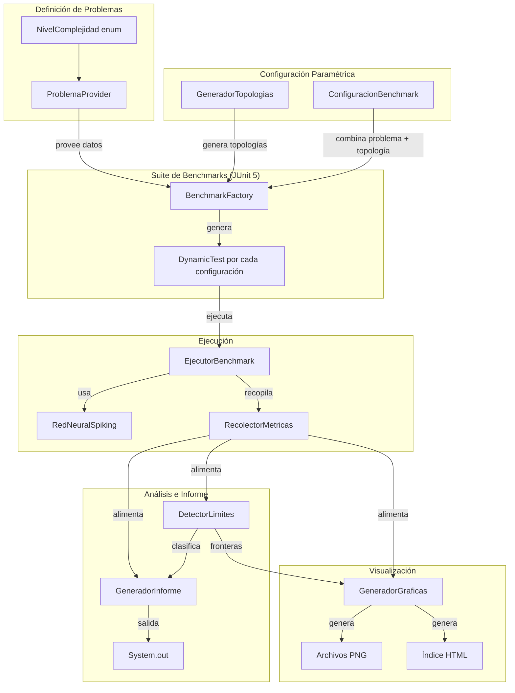
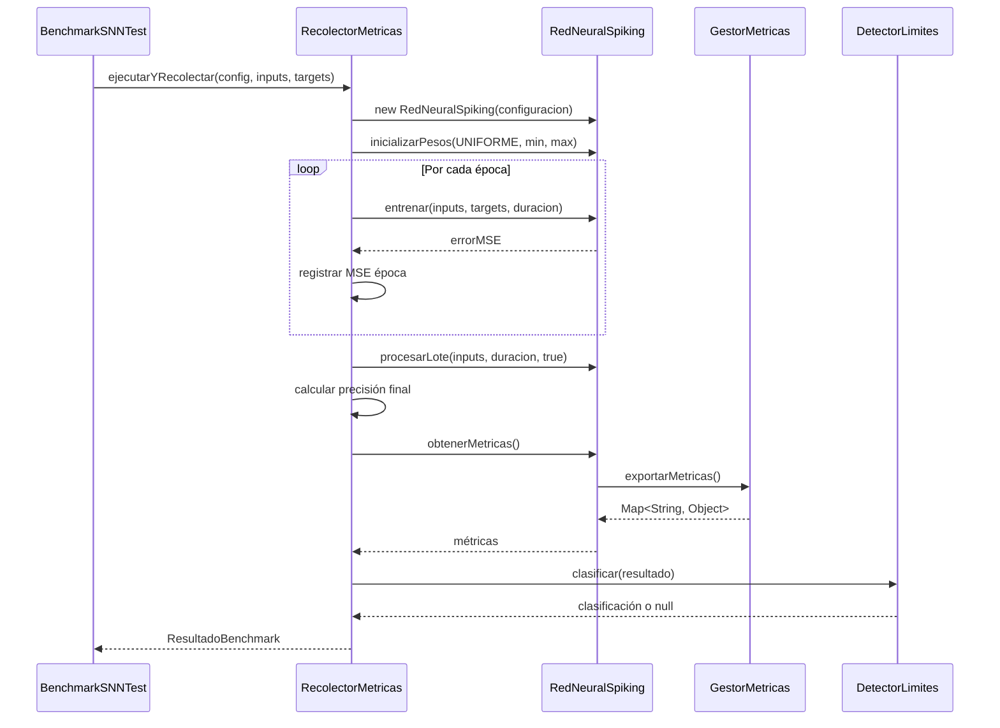
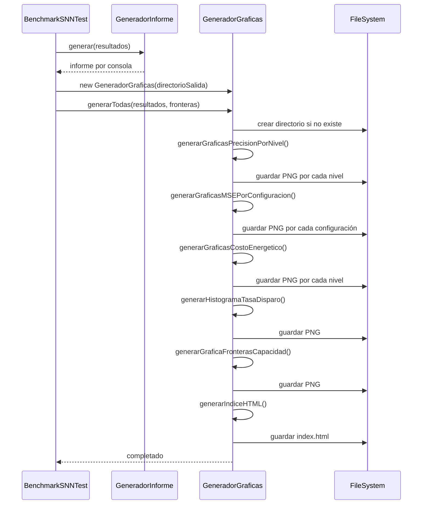

# Documento de Diseño: Suite de Benchmarks para SNN

## Visión General

Este documento describe el diseño técnico de la Suite de Benchmarks para la Red Neuronal Spiking (SNN). El objetivo es crear un marco de pruebas paramétrico que evalúe sistemáticamente el rendimiento de `RedNeuralSpiking` variando topologías de red y niveles de complejidad de problemas (puertas lógicas → 3 en Raya → Gatos → Damas).

El sistema se estructura en cinco componentes principales:
1. **Definición de problemas** por nivel de complejidad (espacio de estados)
2. **Generación paramétrica** de topologías de red
3. **Recolección y agregación** de métricas de rendimiento
4. **Generación de informes** comparativos con detección de límites
5. **Generación de gráficas** para visualización de resultados (PNG + HTML índice)

El framework se integra con JUnit 5 usando `@TestFactory` para generar dinámicamente los casos de prueba a partir de la matriz de configuraciones (topología × problema), y utiliza jqwik para las propiedades de corrección.

## Arquitectura



### Decisiones de Diseño

1. **`@TestFactory` sobre `@ParameterizedTest`**: Se elige `@TestFactory` con `DynamicTest` porque permite generar la matriz completa de configuraciones programáticamente sin necesidad de definir cada combinación como argumento. Esto facilita la extensibilidad (Requisito 1.3).

2. **Semillas fijas en `ConfiguracionBenchmark`**: Cada configuración incluye una semilla aleatoria fija que se usa para inicializar pesos de la red, garantizando reproducibilidad (Requisito 6.1). Se usa `TipoInicializacion.UNIFORME` con la semilla controlando el `Random` que genera los pesos.

3. **Timeout por ejecución**: Se implementa un timeout de 120 segundos por benchmark individual usando `assertTimeoutPreemptively` de JUnit 5 (Requisito 4.5), que aborta la ejecución en un hilo separado.

4. **Reutilización de `GestorMetricas`**: Se aprovecha la clase existente `GestorMetricas` para spikes, tasa de disparo, costo energético y dispersión. Las métricas adicionales (precisión, MSE por época, tiempo) se calculan en `RecolectorMetricas` como wrapper.

5. **XChart para generación de gráficas**: Se elige XChart (org.knowm.xchart) sobre JFreeChart por su API más simple, menor número de dependencias y soporte nativo para exportación a PNG y HTML. XChart permite crear gráficas de barras, líneas e histogramas con pocas líneas de código, lo cual se alinea con el principio de mínima complejidad. Se añade como dependencia Maven: `org.knowm.xchart:xchart:3.8.7`.

## Componentes e Interfaces

### 1. NivelComplejidad (enum)

```java
package es.jastxz.nn.benchmark;

public enum NivelComplejidad {
    TRIVIAL("Puertas Lógicas", 4, 2, 1),
    BAJO("3 en Raya", 5_478, 10, 9),
    MEDIO("Gatos", 100_000, 25, 25),
    ALTO("Damas", 500_000_000_000_000_000_00L, 32, 32);

    private final String nombreProblema;
    private final long espacioEstados;
    private final int dimensionEntrada;
    private final int dimensionSalida;

    // Constructor, getters
}
```

### 2. ConfiguracionBenchmark (record)

```java
package es.jastxz.nn.benchmark;

public record ConfiguracionBenchmark(
    NivelComplejidad nivel,
    int[] topologia,
    int epocas,
    int duracionTimesteps,
    int repeticiones,
    long semilla
) {
    public String etiqueta() {
        return nivel.getNombreProblema() + " | " + Arrays.toString(topologia);
    }
}
```

### 3. ResultadoBenchmark (record)

```java
package es.jastxz.nn.benchmark;

public record ResultadoBenchmark(
    ConfiguracionBenchmark configuracion,
    double precisionFinal,
    double[] errorMSEPorEpoca,
    long tiempoEntrenamientoMs,
    long totalSpikes,
    double tasaDisparoPromedio,
    double costoEnergetico,
    double dispersionActividad,
    int neuronasActivas,
    int neuronasTotal,
    String clasificacion  // null, "limite_no_superado", "convergencia_estancada", etc.
) {}
```

### 4. GeneradorTopologias

```java
package es.jastxz.nn.benchmark;

public class GeneradorTopologias {
    private static final int[] CAPAS_OCULTAS = {1, 2, 3, 4};
    private static final int[] FACTORES_NEURONAS = {1, 2, 4, 8};

    public static List<int[]> generar(int entrada, int salida) {
        // Genera todas las combinaciones: capas × factores
        // Ej: entrada=10 → [10,10,9], [10,20,9], [10,40,9], [10,80,9],
        //                   [10,10,10,9], [10,20,20,9], ...
    }
}
```

### 5. RecolectorMetricas

```java
package es.jastxz.nn.benchmark;

public class RecolectorMetricas {
    public ResultadoBenchmark ejecutarYRecolectar(
        ConfiguracionBenchmark config,
        double[][] inputs,
        double[][] targets
    ) {
        // 1. Crear RedNeuralSpiking con topología y semilla
        // 2. Entrenar por N épocas, registrando MSE por época
        // 3. Evaluar precisión final
        // 4. Extraer métricas de GestorMetricas
        // 5. Retornar ResultadoBenchmark
    }
}
```

### 6. DetectorLimites

```java
package es.jastxz.nn.benchmark;

public class DetectorLimites {
    public static String clasificar(ResultadoBenchmark resultado) {
        // Aplica reglas del Requisito 4:
        // - Precisión < 60% → "limite_no_superado"
        // - MSE no baja >1% en 3 épocas → "convergencia_estancada"
        // - Neuronas activas < 20% → "red_infrautilizada"
        // - Costo > 10x mínimo → "ineficiencia_energetica"
        // Retorna null si no hay límite detectado
    }
}
```

### 7. GeneradorInforme

```java
package es.jastxz.nn.benchmark;

public class GeneradorInforme {
    public static void generar(List<ResultadoBenchmark> resultados) {
        // 1. Tabla resumen por configuración
        // 2. Agrupación por NivelComplejidad
        // 3. Sección de hallazgos de límites
        // 4. Topología óptima por nivel
        // 5. Análisis de eficiencia (ratio Precisión/Costo)
        // 6. Detección de fronteras de capacidad
        // Salida por System.out
    }
}
```

### 8. GeneradorGraficas

```java
package es.jastxz.nn.benchmark;

import org.knowm.xchart.*;
import org.knowm.xchart.style.Styler;
import java.nio.file.Path;
import java.util.List;
import java.util.Map;

public class GeneradorGraficas {
    private final Path directorioSalida;

    public GeneradorGraficas(Path directorioSalida) {
        this.directorioSalida = directorioSalida;
    }

    public void generarTodas(List<ResultadoBenchmark> resultados,
                             Map<String, List<String>> fronterasCapacidad) {
        generarGraficasPrecisionPorNivel(resultados);
        generarGraficasMSEPorConfiguracion(resultados);
        generarGraficasCostoEnergetico(resultados);
        generarHistogramaTasaDisparo(resultados);
        generarGraficaFronterasCapacidad(resultados, fronterasCapacidad);
        generarIndiceHTML();
    }

    // Gráfica de barras: Precisión por topología, una gráfica por NivelComplejidad
    void generarGraficasPrecisionPorNivel(List<ResultadoBenchmark> resultados) { }

    // Gráfica de líneas: Evolución MSE por época, una gráfica por ConfiguracionBenchmark
    void generarGraficasMSEPorConfiguracion(List<ResultadoBenchmark> resultados) { }

    // Gráfica de barras: Costo energético por topología, una gráfica por NivelComplejidad
    void generarGraficasCostoEnergetico(List<ResultadoBenchmark> resultados) { }

    // Histograma: Distribución de tasa de disparo agrupado por topología
    void generarHistogramaTasaDisparo(List<ResultadoBenchmark> resultados) { }

    // Gráfica de líneas: Precisión vs nivel de espacio de estados por topología,
    // con marcadores visuales en las fronteras de capacidad
    void generarGraficaFronterasCapacidad(
        List<ResultadoBenchmark> resultados,
        Map<String, List<String>> fronterasCapacidad) { }

    // Genera archivo HTML índice con enlaces a todas las gráficas por sección
    void generarIndiceHTML() { }
}
```

### 9. BenchmarkSNNTest (Test principal)

```java
package es.jastxz.nn.benchmark;

public class BenchmarkSNNTest {
    @TestFactory
    Collection<DynamicTest> benchmarkMatriz() {
        // 1. Para cada NivelComplejidad, obtener datos del problema
        // 2. Generar topologías compatibles
        // 3. Crear ConfiguracionBenchmark por cada combinación
        // 4. Retornar DynamicTest por cada configuración
    }

    @AfterAll
    static void generarInforme() {
        // Generar informe comparativo con todos los resultados
        // Generar gráficas de visualización
    }
}
```

### Diagrama de Secuencia: Ejecución de un Benchmark



### Diagrama de Secuencia: Generación de Gráficas



## Modelos de Datos

### ConfiguracionBenchmark

| Campo | Tipo | Descripción |
|-------|------|-------------|
| nivel | NivelComplejidad | Nivel de complejidad del problema |
| topologia | int[] | Array con tamaños de cada capa [entrada, ocultas..., salida] |
| epocas | int | Número de épocas de entrenamiento |
| duracionTimesteps | int | Timesteps por patrón de entrenamiento |
| repeticiones | int | Número de repeticiones para estadísticas |
| semilla | long | Semilla para reproducibilidad |

### ResultadoBenchmark

| Campo | Tipo | Descripción |
|-------|------|-------------|
| configuracion | ConfiguracionBenchmark | Configuración usada |
| precisionFinal | double | Porcentaje de aciertos (0.0-1.0) |
| errorMSEPorEpoca | double[] | Evolución del MSE por época |
| tiempoEntrenamientoMs | long | Tiempo total de entrenamiento en ms |
| totalSpikes | long | Número total de spikes generados |
| tasaDisparoPromedio | double | Tasa de disparo promedio global |
| costoEnergetico | double | Costo energético (proporcional a spikes) |
| dispersionActividad | double | Desviación estándar de spikes entre neuronas |
| neuronasActivas | int | Neuronas que dispararon al menos un spike |
| neuronasTotal | int | Total de neuronas en la red |
| clasificacion | String | Clasificación de límite o null |

### ResultadoAgregado (para múltiples repeticiones)

| Campo | Tipo | Descripción |
|-------|------|-------------|
| configuracion | ConfiguracionBenchmark | Configuración usada |
| mediaPrecision | double | Media de precisión entre repeticiones |
| desvPrecision | double | Desviación estándar de precisión |
| mediaTiempo | double | Media de tiempo de entrenamiento |
| desvTiempo | double | Desviación estándar de tiempo |
| mediaCostoEnergetico | double | Media de costo energético |
| desvCostoEnergetico | double | Desviación estándar de costo |
| ratioEficiencia | double | Precisión / Costo energético |
| clasificacionMayoritaria | String | Clasificación más frecuente |

### Relación con APIs Existentes

- `ConfiguracionRedBuilder.topologia(int... capas)` → recibe directamente `ConfiguracionBenchmark.topologia`
- `RedNeuralSpiking.entrenar(inputs, targets, duracion)` → retorna MSE del lote
- `RedNeuralSpiking.obtenerMetricas()` → delega a `GestorMetricas.exportarMetricas()`
- `RedNeuralSpiking.procesarLote(inputs, duracion, reset)` → para evaluar precisión post-entrenamiento
- `GestorMetricas.getNeuronasActivas()` → para ratio de neuronas activas
- `GestorMetricas.calcularCostoEnergetico()` → costo proporcional a spikes totales


## Propiedades de Corrección

*Una propiedad es una característica o comportamiento que debe cumplirse en todas las ejecuciones válidas de un sistema — esencialmente, una declaración formal sobre lo que el sistema debe hacer. Las propiedades sirven como puente entre especificaciones legibles por humanos y garantías de corrección verificables por máquina.*

### Propiedad 1: Completitud del generador de topologías

*Para cualquier* par de dimensiones de entrada y salida válidas, el generador de topologías debe producir exactamente 16 topologías (4 niveles de capas ocultas × 4 factores de neuronas), donde cada topología comienza con la dimensión de entrada, termina con la dimensión de salida, y las capas ocultas tienen el tamaño correcto según el factor correspondiente.

**Valida: Requisitos 2.1, 2.2, 2.4**

### Propiedad 2: Validación de compatibilidad topología-problema

*Para cualquier* ConfiguracionBenchmark, el primer elemento de la topología debe coincidir con la dimensión de entrada del problema y el último elemento debe coincidir con la dimensión de salida. Configuraciones donde esto no se cumple deben ser rechazadas con una excepción.

**Valida: Requisito 2.3**

### Propiedad 3: Completitud y validez de métricas en resultados

*Para cualquier* ResultadoBenchmark generado por el RecolectorMetricas, el resultado debe contener: el nombre del problema y espacio de estados del nivel de complejidad, precisión final en rango [0.0, 1.0], array de MSE no vacío, tiempo de entrenamiento >= 0, totalSpikes >= 0, tasaDisparoPromedio >= 0, costoEnergetico >= 0, dispersionActividad >= 0, y neuronasActivas en rango [0, neuronasTotal].

**Valida: Requisitos 1.1, 1.2, 3.1, 3.2**

### Propiedad 4: Seguimiento de MSE por época

*Para cualquier* ejecución de benchmark configurada con N épocas, el array errorMSEPorEpoca del resultado debe tener exactamente N elementos, y cada elemento debe ser un valor no negativo.

**Valida: Requisito 3.4**

### Propiedad 5: Asociación configuración-resultado

*Para cualquier* ResultadoBenchmark, la configuración almacenada en el resultado debe ser idéntica a la configuración usada para ejecutar el benchmark (misma topología, mismo nivel, mismos parámetros).

**Valida: Requisito 3.3**

### Propiedad 6: Corrección de la detección de límites

*Para cualquier* ResultadoBenchmark con métricas conocidas, el DetectorLimites debe clasificar correctamente: "limite_no_superado" si precisión < 0.6, "convergencia_estancada" si el MSE no disminuye más de 1% en 3 épocas consecutivas, "red_infrautilizada" si neuronas activas < 20% del total, y null si ninguna condición se cumple. Las clasificaciones deben ser mutuamente consistentes con los umbrales definidos.

**Valida: Requisitos 4.1, 4.2, 4.3**

### Propiedad 7: Corrección de la agregación estadística

*Para cualquier* lista de N valores numéricos de métricas (N >= 1), la media calculada debe ser igual a la suma dividida por N, y la desviación estándar debe ser la raíz cuadrada de la varianza muestral. Para N=1, la desviación estándar debe ser 0.

**Valida: Requisito 6.3**

### Propiedad 8: Completitud del informe

*Para cualquier* lista de ResultadoBenchmark, el informe generado debe contener una línea por cada configuración, los resultados deben aparecer agrupados por NivelComplejidad, y todas las configuraciones con clasificación no nula deben aparecer en la sección de "hallazgos de límites".

**Valida: Requisitos 5.1, 5.2, 5.3**

### Propiedad 9: Selección de topología óptima

*Para cualquier* conjunto de resultados para un mismo nivel de complejidad, la topología óptima seleccionada debe ser aquella con la mayor ratio Precisión/CostoEnergético. Si hay empate, cualquiera de las empatadas es válida.

**Valida: Requisitos 5.5, 7.1**

### Propiedad 10: Detección de frontera de capacidad

*Para cualquier* par de resultados con la misma topología en niveles de complejidad consecutivos, si la precisión en el nivel inferior es > 0.7 y en el nivel superior es < 0.5, el informe debe señalar esa topología como "frontera de capacidad" en la transición entre esos niveles.

**Valida: Requisito 7.4**

### Propiedad 11: Detección de ineficiencia energética

*Para cualquier* conjunto de resultados del mismo problema, si el costo energético de una configuración supera 10 veces el costo mínimo del conjunto, esa configuración debe ser clasificada como "ineficiencia_energetica".

**Valida: Requisito 4.4**

### Propiedad 12: Completitud de gráficas de barras por nivel de complejidad

*Para cualquier* lista de ResultadoBenchmark con al menos un resultado por nivel de complejidad, y para cada tipo de métrica visualizada en barras (precisión, costo energético), el GeneradorGraficas debe producir exactamente una gráfica PNG por nivel de complejidad presente, donde cada gráfica contiene una barra por cada topología evaluada en ese nivel, y el valor de cada barra corresponde al valor de la métrica en el ResultadoBenchmark correspondiente.

**Valida: Requisitos 8.1, 8.3**

### Propiedad 13: Correspondencia de datos en gráficas de evolución MSE

*Para cualquier* ResultadoBenchmark con N épocas, la gráfica de líneas generada para esa configuración debe contener exactamente N puntos de datos, y el valor del punto i-ésimo debe coincidir con errorMSEPorEpoca[i] del resultado.

**Valida: Requisito 8.2**

### Propiedad 14: Visualización correcta de fronteras de capacidad

*Para cualquier* conjunto de resultados donde existen fronteras de capacidad detectadas (precisión > 0.7 en un nivel y < 0.5 en el siguiente para la misma topología), la gráfica de fronteras debe incluir una serie de datos por cada topología y un marcador visual en cada transición de frontera identificada.

**Valida: Requisito 8.5**

### Propiedad 15: Corrección de metadatos y formato de salida de gráficas

*Para cualquier* gráfica generada por el GeneradorGraficas, el archivo de salida debe existir en el directorio configurado en formato PNG, y el objeto de gráfica debe contener un título no vacío, etiquetas en ambos ejes, y leyenda cuando la gráfica incluye más de una serie de datos.

**Valida: Requisitos 8.6, 8.7**

## Manejo de Errores

| Escenario | Comportamiento |
|-----------|---------------|
| Topología incompatible con problema | `IllegalArgumentException` al crear `ConfiguracionBenchmark` con mensaje indicando la incompatibilidad de dimensiones |
| Datos de entrenamiento vacíos o null | `IllegalArgumentException` propagada desde `RedNeuralSpiking.entrenar()` |
| Timeout de 120 segundos | `assertTimeoutPreemptively` de JUnit 5 aborta la ejecución; el resultado se registra con clasificación "timeout" y métricas parciales (las disponibles hasta el momento del aborto) |
| Error durante entrenamiento (NaN, Infinity) | Se captura, se registra el resultado con precisión 0.0 y clasificación "error_entrenamiento" |
| Semilla inválida (negativa) | Se acepta cualquier valor long como semilla válida (Java Random acepta cualquier long) |
| Sin resultados para generar informe | El informe muestra un mensaje indicando que no hay resultados disponibles |
| División por cero en ratio eficiencia | Si costoEnergetico es 0, la ratio se define como `Double.POSITIVE_INFINITY` (precisión perfecta sin costo) |
| Error al escribir archivo PNG | Se captura `IOException`, se registra un warning en System.err y se continúa con las demás gráficas sin abortar la ejecución |
| Directorio de salida no existe | Se crea automáticamente con `Files.createDirectories()` al iniciar la generación de gráficas |
| Lista de resultados vacía para gráficas | Se omite la generación de gráficas y se registra un mensaje informativo en System.out |

## Estrategia de Testing

### Testing Dual: Unit Tests + Property-Based Tests

La suite de testing combina dos enfoques complementarios:

**Tests unitarios (JUnit 5)**: Verifican ejemplos específicos, casos borde y condiciones de error.
- Ejemplo: verificar que `NivelComplejidad.TRIVIAL` tiene espacio de estados = 4
- Ejemplo: verificar que el timeout aborta una ejecución que excede 120 segundos
- Ejemplo: verificar que el informe se genera correctamente para un conjunto vacío de resultados
- Ejemplo: verificar que el índice HTML contiene enlaces a todas las gráficas generadas (Requisito 8.8)
- Caso borde: topología con una sola capa oculta y factor 1x
- Caso borde: resultado con 0 neuronas activas
- Caso borde: MSE constante en todas las épocas (convergencia estancada)
- Caso borde: generación de gráficas con lista vacía de resultados

**Tests de propiedades (jqwik)**: Verifican propiedades universales con entradas generadas aleatoriamente.
- Cada propiedad del documento de diseño se implementa como un único test jqwik
- Mínimo 100 iteraciones por test de propiedad
- Cada test debe incluir un comentario referenciando la propiedad del diseño

### Configuración de Property-Based Testing

- **Librería**: jqwik 1.7.4 (ya configurada en pom.xml)
- **Iteraciones mínimas**: 100 por propiedad (`@Property(tries = 100)`)
- **Formato de etiqueta**: `// Feature: snn-benchmark-suite, Property {N}: {título}`

### Generadores jqwik Necesarios

- **Generador de dimensiones**: enteros positivos para entrada/salida (rango 1-100)
- **Generador de ResultadoBenchmark**: resultados con métricas aleatorias válidas
- **Generador de series MSE**: arrays de doubles positivos para simular evolución de error
- **Generador de listas de resultados**: listas de ResultadoBenchmark con configuraciones variadas
- **Generador de listas de resultados por nivel**: listas de ResultadoBenchmark agrupadas por NivelComplejidad con múltiples topologías, para validar generación de gráficas

### Mapeo Propiedades → Tests

| Propiedad | Tipo de Test | Etiqueta |
|-----------|-------------|----------|
| 1: Completitud del generador | jqwik @Property | Feature: snn-benchmark-suite, Property 1: Completitud del generador de topologías |
| 2: Validación topología-problema | jqwik @Property | Feature: snn-benchmark-suite, Property 2: Validación de compatibilidad topología-problema |
| 3: Completitud de métricas | jqwik @Property | Feature: snn-benchmark-suite, Property 3: Completitud y validez de métricas en resultados |
| 4: Seguimiento MSE | jqwik @Property | Feature: snn-benchmark-suite, Property 4: Seguimiento de MSE por época |
| 5: Asociación config-resultado | jqwik @Property | Feature: snn-benchmark-suite, Property 5: Asociación configuración-resultado |
| 6: Detección de límites | jqwik @Property | Feature: snn-benchmark-suite, Property 6: Corrección de la detección de límites |
| 7: Agregación estadística | jqwik @Property | Feature: snn-benchmark-suite, Property 7: Corrección de la agregación estadística |
| 8: Completitud del informe | jqwik @Property | Feature: snn-benchmark-suite, Property 8: Completitud del informe |
| 9: Topología óptima | jqwik @Property | Feature: snn-benchmark-suite, Property 9: Selección de topología óptima |
| 10: Frontera de capacidad | jqwik @Property | Feature: snn-benchmark-suite, Property 10: Detección de frontera de capacidad |
| 11: Ineficiencia energética | jqwik @Property | Feature: snn-benchmark-suite, Property 11: Detección de ineficiencia energética |
| 12: Gráficas de barras por nivel | jqwik @Property | Feature: snn-benchmark-suite, Property 12: Completitud de gráficas de barras por nivel de complejidad |
| 13: Datos MSE en gráficas | jqwik @Property | Feature: snn-benchmark-suite, Property 13: Correspondencia de datos en gráficas de evolución MSE |
| 14: Fronteras de capacidad visual | jqwik @Property | Feature: snn-benchmark-suite, Property 14: Visualización correcta de fronteras de capacidad |
| 15: Metadatos y formato de gráficas | jqwik @Property | Feature: snn-benchmark-suite, Property 15: Corrección de metadatos y formato de salida de gráficas |
