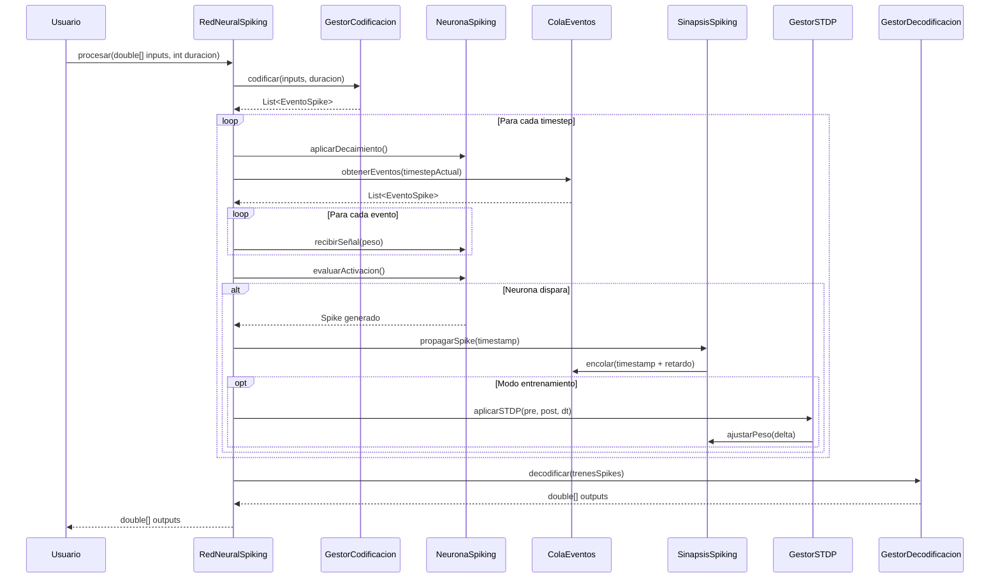

# Documento de Diseño Técnico: Spiking Neural Network

## Overview

Este documento define el diseño técnico para implementar una Red Neuronal de Spikes (Spiking Neural Network - SNN) independiente en Java. La implementación se basa en el modelo Leaky Integrate-and-Fire (LIF) con plasticidad STDP (Spike-Timing-Dependent Plasticity), codificación por tasa de disparo (rate coding), y período refractario.

### Objetivos del Diseño

1. **Independencia**: Crear una implementación completamente separada de `RedNeuralExperimental`, sin dependencias compartidas
2. **Biológicamente Plausible**: Modelar comportamiento neuronal realista con integración temporal, decaimiento exponencial y períodos refractarios
3. **Aprendizaje Temporal**: Implementar STDP para aprendizaje basado en timing preciso de spikes
4. **Eficiencia Temporal**: Optimizar para simulaciones con muchos timesteps discretos
5. **Configurabilidad**: Permitir configuración flexible mediante builders y archivos JSON
6. **Persistencia**: Soportar serialización completa del estado de la red

### Principios de Diseño

- **Separación de Responsabilidades**: Usar gestores especializados para codificación, decodificación, STDP, métricas y registro
- **Eventos Discretos**: Modelar spikes como eventos discretos con timestamps precisos
- **Cola de Eventos**: Implementar cola de eventos para manejar retardos sinápticos eficientemente
- **Inmutabilidad de Configuración**: Los parámetros neuronales son inmutables después de construcción (excepto pesos sinápticos por aprendizaje)
- **Validación Temprana**: Validar arquitectura y parámetros durante construcción, no durante ejecución


## Architecture

### Arquitectura General

La SNN sigue una arquitectura modular con separación clara entre componentes:

```
┌─────────────────────────────────────────────────────────────┐
│                    RedNeuralSpiking                         │
│  ┌──────────────┐  ┌──────────────┐  ┌──────────────┐     │
│  │ Capa Entrada │→ │ Capas Ocultas│→ │ Capa Salida  │     │
│  └──────────────┘  └──────────────┘  └──────────────┘     │
│         ↓                  ↓                  ↓             │
│  ┌─────────────────────────────────────────────────┐       │
│  │          Cola de Eventos (Spikes)               │       │
│  └─────────────────────────────────────────────────┘       │
└─────────────────────────────────────────────────────────────┘
         ↓              ↓              ↓              ↓
┌──────────────┐ ┌──────────────┐ ┌──────────────┐ ┌──────────────┐
│ Codificador  │ │ Decodificador│ │ Gestor STDP  │ │ Gestor       │
│ Rate Coding  │ │ Rate Coding  │ │              │ │ Métricas     │
└──────────────┘ └──────────────┘ └──────────────┘ └──────────────┘
```

### Componentes Principales

#### 1. RedNeuralSpiking
Clase principal que orquesta la simulación temporal. Responsabilidades:
- Mantener arquitectura de capas
- Avanzar simulación timestep por timestep
- Coordinar propagación de spikes
- Gestionar cola de eventos para retardos
- Aplicar STDP durante aprendizaje
- Exponer API para configuración y consulta

#### 2. NeuronaSpiking
Unidad computacional que implementa modelo LIF. Responsabilidades:
- Mantener potencial de membrana con decaimiento exponencial
- Detectar cuando alcanza umbral de disparo
- Generar spikes (eventos discretos)
- Respetar período refractario
- Registrar historial de spikes

#### 3. SinapsisSpiking
Conexión entre neuronas con peso y retardo. Responsabilidades:
- Transmitir spikes con retardo configurable
- Mantener peso sináptico mutable por STDP
- Registrar timestamps de spikes pre y post para STDP
- Encolar eventos de spike con timestamp de entrega

#### 4. GestorCodificacion
Convierte valores continuos a trenes de spikes. Responsabilidades:
- Implementar codificación Poisson (probabilística)
- Implementar codificación regular (determinística)
- Implementar codificación burst
- Mapear valores [0,1] a frecuencias de disparo

#### 5. GestorDecodificacion
Convierte trenes de spikes a valores continuos. Responsabilidades:
- Contar spikes en ventana temporal
- Calcular frecuencia de disparo
- Normalizar a rango [0,1]
- Mantener ventanas deslizantes por neurona

#### 6. GestorSTDP
Aplica plasticidad dependiente del timing. Responsabilidades:
- Calcular diferencias temporales entre spikes pre y post
- Aplicar LTP (Long-Term Potentiation) cuando pre precede a post
- Aplicar LTD (Long-Term Depression) cuando post precede a pre
- Usar ventanas exponenciales para cambios de peso
- Mantener pesos dentro de límites configurables

#### 7. GestorMetricas
Calcula y mantiene métricas de rendimiento. Responsabilidades:
- Contar spikes totales y por neurona
- Calcular tasas de disparo promedio
- Estimar costo energético
- Calcular dispersión de actividad
- Exportar métricas en formato estructurado

#### 8. RegistroActividad
Registra actividad neuronal para análisis. Responsabilidades:
- Registrar cada spike con timestamp, capa e índice de neurona
- Mantener trenes de spikes por neurona
- Exportar a CSV para visualización
- Generar raster plots


### Flujo de Ejecución

#### Procesamiento de un Patrón



#### Simulación Temporal

1. **Inicialización**: Codificar inputs a eventos de spike
2. **Loop Temporal**: Para cada timestep:
   - Aplicar decaimiento exponencial a todas las neuronas
   - Procesar eventos de spike pendientes para este timestep
   - Evaluar activación de cada neurona
   - Generar nuevos spikes si se alcanza umbral
   - Propagar spikes a través de sinapsis (con retardo)
   - Aplicar STDP si está en modo entrenamiento
3. **Finalización**: Decodificar trenes de spikes a valores continuos


## Components and Interfaces

### Clases Principales

#### RedNeuralSpiking

```java
public class RedNeuralSpiking implements Serializable {
    // Arquitectura
    private final List<List<NeuronaSpiking>> capas;
    private final List<SinapsisSpiking> sinapsis;
    
    // Simulación temporal
    private long timestepActual;
    private final double duracionTimestep; // en ms
    private final ColaEventos colaEventos;
    
    // Gestores
    private final GestorCodificacion codificador;
    private final GestorDecodificacion decodificador;
    private final GestorSTDP gestorSTDP;
    private final GestorMetricas gestorMetricas;
    private final RegistroActividad registro;
    
    // Configuración
    private final ConfiguracionRed configuracion;
    private boolean modoEntrenamiento;
    
    // API Principal
    public double[] procesar(double[] inputs, int duracionTimesteps);
    public void entrenar(double[][] batchInputs, double[][] batchTargets, int duracionPorPatron);
    public void avanzarTimestep();
    public void resetearEstadoTemporal();
    
    // Configuración
    public void setModoEntrenamiento(boolean activar);
    public void aplicarSTDP(boolean activar);
    public void normalizarPesos(TipoNormalizacion tipo, int[] capasObjetivo);
    
    // Consulta
    public List<EventoSpike> obtenerSpikes(int capa, int neurona);
    public double obtenerFrecuenciaDisparo(int capa, int neurona);
    public Map<String, Object> obtenerMetricas();
    public String exportarRegistroCSV();
    
    // Persistencia
    public void guardar(String filename) throws IOException;
    public static RedNeuralSpiking cargar(String filename) throws IOException, ClassNotFoundException;
    public static RedNeuralSpiking desdeJSON(String jsonConfig) throws IOException;
    public String toJSON();
}
```

#### NeuronaSpiking

```java
public class NeuronaSpiking implements Serializable {
    // Identificación
    private final long id;
    private final int capa;
    private final int indice;
    
    // Parámetros LIF (inmutables)
    private final double umbralDisparo;
    private final double potencialReposo;
    private final double constanteDecaimiento; // tau en ms
    private final int duracionRefractario; // en timesteps
    
    // Estado temporal (mutable)
    private double potencialMembrana;
    private long timestampUltimoSpike;
    private int timestepsDesdeUltimoSpike;
    
    // Historial
    private final List<Long> historialSpikes;
    
    // Homeostasis (opcional)
    private double tasaDisparoObjetivo;
    private double tasaDisparoPromedio;
    private double tasaAjusteHomeostasis;
    
    // Métodos principales
    public void aplicarDecaimiento(double dt);
    public void recibirSeñal(double señal);
    public boolean evaluarActivacion(long timestepActual);
    public void generarSpike(long timestamp);
    public boolean estaEnRefractario(long timestepActual);
    
    // Homeostasis
    public void aplicarHomeostasis();
    public void actualizarTasaPromedio(long ventanaTemporal);
    
    // Consulta
    public double getPotencialMembrana();
    public List<Long> getHistorialSpikes();
    public double calcularFrecuencia(long ventanaTemporal);
}
```


#### SinapsisSpiking

```java
public class SinapsisSpiking implements Serializable {
    // Conexión
    private final NeuronaSpiking presinaptica;
    private final NeuronaSpiking postsinaptica;
    
    // Parámetros
    private double peso; // mutable por STDP
    private final int retardo; // en timesteps
    
    // Límites de peso
    private final double pesoMin;
    private final double pesoMax;
    
    // Historial para STDP
    private Long timestampUltimoSpikePresinaptico;
    private Long timestampUltimoSpikePostsinaptico;
    
    // Métodos principales
    public EventoSpike propagarSpike(long timestampOrigen);
    public void ajustarPeso(double delta);
    public void aplicarSTDP(ParametrosSTDP params);
    
    // Consulta
    public double getPeso();
    public int getRetardo();
    public NeuronaSpiking getPresinaptica();
    public NeuronaSpiking getPostsinaptica();
}
```

#### GestorCodificacion

```java
public class GestorCodificacion {
    // Configuración
    private final double frecuenciaMaxima; // Hz
    private final ModoCodificacion modo;
    private final Random random;
    
    // Métodos principales
    public List<EventoSpike> codificar(double[] valores, int duracionTimesteps);
    public List<EventoSpike> codificarPoisson(double valor, int neuronaId, int duracion);
    public List<EventoSpike> codificarRegular(double valor, int neuronaId, int duracion);
    public List<EventoSpike> codificarBurst(double valor, int neuronaId, int duracion);
    
    // Configuración
    public void setModo(ModoCodificacion modo);
    public void setFrecuenciaMaxima(double frecuencia);
}
```

#### GestorDecodificacion

```java
public class GestorDecodificacion {
    // Configuración
    private final int ventanaTemporal; // en timesteps
    private final double frecuenciaMaxima; // Hz
    
    // Estado
    private final Map<Long, VentanaDeslizante> ventanasPorNeurona;
    
    // Métodos principales
    public double decodificar(List<EventoSpike> spikes);
    public double[] decodificarCapa(List<List<EventoSpike>> spikesPorNeurona);
    public void actualizarVentana(long neuronaId, long timestamp);
    public int contarSpikesEnVentana(long neuronaId, long timestampActual);
    
    // Configuración
    public void setVentanaTemporal(int timesteps);
}
```

#### GestorSTDP

```java
public class GestorSTDP {
    // Parámetros STDP
    private final double amplitudLTP;
    private final double amplitudLTD;
    private final double tauLTP; // constante de tiempo para LTP en ms
    private final double tauLTD; // constante de tiempo para LTD en ms
    
    // Métodos principales
    public void aplicarSTDP(SinapsisSpiking sinapsis, long timestampActual);
    public double calcularCambioPeso(long dt, boolean esLTP);
    public void aplicarSTDPACapa(List<SinapsisSpiking> sinapsis, long timestampActual);
    
    // Fórmula: dw = A * exp(-|dt|/tau)
    // Si dt > 0 (pre antes que post): LTP (refuerzo)
    // Si dt < 0 (post antes que pre): LTD (debilitamiento)
}
```


#### GestorMetricas

```java
public class GestorMetricas {
    // Contadores
    private long totalSpikes;
    private final Map<Long, Integer> spikesPorNeurona;
    private final Map<Long, List<Long>> timestampsPorNeurona;
    
    // Métodos principales
    public void registrarSpike(long neuronaId, long timestamp);
    public long getTotalSpikes();
    public double getTasaPromedioGlobal();
    public double getTasaPromedioPorNeurona(long neuronaId);
    public double calcularCostoEnergetico();
    public double calcularDispersionActividad();
    public Map<String, Object> exportarMetricas();
    public void resetear();
}
```

#### RegistroActividad

```java
public class RegistroActividad implements Serializable {
    // Registro
    private final List<EventoSpike> todosLosSpikes;
    private final Map<Long, List<EventoSpike>> spikesPorNeurona;
    
    // Métodos principales
    public void registrar(EventoSpike evento);
    public List<EventoSpike> obtenerSpikes(long neuronaId);
    public List<EventoSpike> obtenerSpikesEnRango(long timestampInicio, long timestampFin);
    public String exportarCSV();
    public String generarRasterPlot();
    public void limpiar();
}
```

### Clases de Datos

#### EventoSpike

```java
public class EventoSpike implements Comparable<EventoSpike>, Serializable {
    private final long neuronaId;
    private final int capa;
    private final int indice;
    private final long timestamp;
    private final double potencialMembrana;
    
    @Override
    public int compareTo(EventoSpike otro) {
        return Long.compare(this.timestamp, otro.timestamp);
    }
}
```

#### ColaEventos

```java
public class ColaEventos {
    private final PriorityQueue<EventoSpike> cola;
    
    public void encolar(EventoSpike evento);
    public List<EventoSpike> obtenerEventos(long timestamp);
    public boolean hayEventosPendientes();
    public void limpiar();
}
```

#### ConfiguracionRed

```java
public class ConfiguracionRed implements Serializable {
    // Arquitectura
    public final int[] topologia;
    
    // Parámetros neuronales
    public final double umbralDisparo;
    public final double potencialReposo;
    public final double constanteDecaimiento;
    public final int duracionRefractario;
    
    // Parámetros STDP
    public final double amplitudLTP;
    public final double amplitudLTD;
    public final double tauLTP;
    public final double tauLTD;
    
    // Parámetros de codificación
    public final double frecuenciaMaxima;
    public final ModoCodificacion modoCodificacion;
    public final int ventanaDecodificacion;
    
    // Inicialización de pesos
    public final TipoInicializacion tipoInicializacion;
    public final double pesoMin;
    public final double pesoMax;
    
    // Retardos
    public final int retardoMin;
    public final int retardoMax;
    
    // Homeostasis (opcional)
    public final boolean homeostasisActiva;
    public final double tasaDisparoObjetivo;
    
    // Inhibición lateral (opcional)
    public final boolean inhibicionLateralActiva;
    public final int radioInhibicion;
    public final double fuerzaInhibicion;
}
```


### Enumeraciones

#### ModoCodificacion

```java
public enum ModoCodificacion {
    POISSON,    // Generación probabilística (biológicamente realista)
    REGULAR,    // Espaciado uniforme (determinístico)
    BURST       // Ráfagas de spikes
}
```

#### TipoInicializacion

```java
public enum TipoInicializacion {
    UNIFORME,   // Distribución uniforme en [min, max]
    NORMAL,     // Distribución normal con media y desviación
    CONSTANTE,  // Todos los pesos al mismo valor
    DESDE_ARRAY // Cargar desde array proporcionado
}
```

#### TipoNormalizacion

```java
public enum TipoNormalizacion {
    L1,  // Suma de valores absolutos
    L2   // Suma de cuadrados
}
```

### Builder Pattern

#### ConfiguracionRedBuilder

```java
public class ConfiguracionRedBuilder {
    // Valores por defecto
    private int[] topologia = {10, 20, 10};
    private double umbralDisparo = -55.0; // mV
    private double potencialReposo = -70.0; // mV
    private double constanteDecaimiento = 20.0; // ms
    private int duracionRefractario = 2; // timesteps
    
    private double amplitudLTP = 0.01;
    private double amplitudLTD = 0.012;
    private double tauLTP = 20.0; // ms
    private double tauLTD = 20.0; // ms
    
    private double frecuenciaMaxima = 100.0; // Hz
    private ModoCodificacion modoCodificacion = ModoCodificacion.POISSON;
    private int ventanaDecodificacion = 50; // timesteps
    
    private TipoInicializacion tipoInicializacion = TipoInicializacion.UNIFORME;
    private double pesoMin = 0.0;
    private double pesoMax = 1.0;
    
    private int retardoMin = 1;
    private int retardoMax = 5;
    
    private boolean homeostasisActiva = false;
    private double tasaDisparoObjetivo = 10.0; // Hz
    
    private boolean inhibicionLateralActiva = false;
    private int radioInhibicion = 2;
    private double fuerzaInhibicion = 0.5;
    
    // Métodos builder
    public ConfiguracionRedBuilder topologia(int... capas);
    public ConfiguracionRedBuilder parametrosLIF(double umbral, double reposo, double tau, int refractario);
    public ConfiguracionRedBuilder parametrosSTDP(double aLTP, double aLTD, double tLTP, double tLTD);
    public ConfiguracionRedBuilder parametrosCodificacion(double freqMax, ModoCodificacion modo, int ventana);
    public ConfiguracionRedBuilder inicializacionPesos(TipoInicializacion tipo, double min, double max);
    public ConfiguracionRedBuilder retardos(int min, int max);
    public ConfiguracionRedBuilder homeostasis(boolean activar, double tasaObjetivo);
    public ConfiguracionRedBuilder inhibicionLateral(boolean activar, int radio, double fuerza);
    
    public ConfiguracionRed build();
}
```


## Data Models

### Modelo de Datos Neuronal

#### Potencial de Membrana

El potencial de membrana sigue el modelo Leaky Integrate-and-Fire con decaimiento exponencial:

```
V(t+1) = V(t) * exp(-dt/tau) + V_reposo * (1 - exp(-dt/tau)) + I(t)
```

Donde:
- `V(t)`: Potencial de membrana en el timestep t
- `dt`: Duración del timestep (en ms)
- `tau`: Constante de decaimiento (en ms)
- `V_reposo`: Potencial de reposo (típicamente -70 mV)
- `I(t)`: Corriente de entrada en el timestep t (suma de señales sinápticas)

#### Generación de Spike

Cuando `V(t) >= umbral_disparo`:
1. Generar evento spike con timestamp actual
2. Resetear `V(t) = V_reposo`
3. Entrar en período refractario
4. Registrar spike en historial

Durante período refractario (duración configurable):
- Ignorar todas las señales de entrada
- No evaluar condición de disparo
- Mantener `V(t) = V_reposo`

### Modelo de Datos Sináptico

#### Transmisión de Spike

Cuando una neurona presinaptica genera un spike:
1. Para cada sinapsis saliente:
   - Calcular timestamp de entrega: `t_entrega = t_actual + retardo`
   - Crear evento spike con peso sináptico
   - Encolar evento en cola de eventos

Cuando llega el timestamp de entrega:
1. Neurona postsináptica recibe señal: `I += peso_sinaptico`
2. Acumular en potencial de membrana

#### Plasticidad STDP

Cambio de peso basado en diferencia temporal entre spikes:

```
Si dt > 0 (pre antes que post):
    dw = A_LTP * exp(-dt/tau_LTP)  [Refuerzo - LTP]

Si dt < 0 (post antes que pre):
    dw = -A_LTD * exp(dt/tau_LTD)  [Debilitamiento - LTD]
```

Donde:
- `dt = t_post - t_pre`: Diferencia temporal entre spikes
- `A_LTP`: Amplitud de Long-Term Potentiation (típicamente 0.01)
- `A_LTD`: Amplitud de Long-Term Depression (típicamente 0.012)
- `tau_LTP`: Constante de tiempo para LTP (típicamente 20 ms)
- `tau_LTD`: Constante de tiempo para LTD (típicamente 20 ms)

Actualización de peso:
```
peso_nuevo = clamp(peso_actual + dw, peso_min, peso_max)
```


### Modelo de Codificación/Decodificación

#### Rate Coding - Codificación

Conversión de valor continuo a frecuencia de spikes:

**Codificación Poisson** (probabilística):
```
Para cada timestep t en [0, duracion]:
    probabilidad = valor * frecuencia_maxima * dt
    si random() < probabilidad:
        generar spike en timestep t
```

**Codificación Regular** (determinística):
```
frecuencia = valor * frecuencia_maxima
intervalo = 1.0 / frecuencia  (en timesteps)
Para t = 0, intervalo, 2*intervalo, ..., duracion:
    generar spike en timestep t
```

**Codificación Burst**:
```
frecuencia = valor * frecuencia_maxima
num_bursts = frecuencia * duracion / burst_size
Para cada burst:
    timestamp_inicio = distribuir uniformemente en duracion
    generar burst_size spikes consecutivos desde timestamp_inicio
```

#### Rate Coding - Decodificación

Conversión de tren de spikes a valor continuo:

```
conteo_spikes = contar spikes en ventana_temporal
frecuencia_observada = conteo_spikes / (ventana_temporal * dt)
valor = frecuencia_observada / frecuencia_maxima
valor_normalizado = clamp(valor, 0.0, 1.0)
```

### Modelo de Cola de Eventos

La cola de eventos usa una `PriorityQueue` ordenada por timestamp:

```java
class ColaEventos {
    PriorityQueue<EventoSpike> cola;  // Ordenada por timestamp
    
    void encolar(EventoSpike evento) {
        cola.add(evento);  // O(log n)
    }
    
    List<EventoSpike> obtenerEventos(long timestamp) {
        List<EventoSpike> eventos = new ArrayList<>();
        while (!cola.isEmpty() && cola.peek().timestamp == timestamp) {
            eventos.add(cola.poll());
        }
        return eventos;
    }
}
```

Complejidad temporal:
- Encolar: O(log n)
- Obtener eventos: O(k log n) donde k es el número de eventos en el timestamp
- Espacio: O(n) donde n es el número total de eventos pendientes

### Modelo de Homeostasis

Ajuste dinámico del umbral de disparo para mantener tasa objetivo:

```
tasa_actual = calcular_tasa_promedio(ventana_temporal)
error = tasa_objetivo - tasa_actual

Si error > 0 (disparando muy poco):
    umbral_nuevo = umbral_actual * (1 - tasa_ajuste * error)
    
Si error < 0 (disparando demasiado):
    umbral_nuevo = umbral_actual * (1 + tasa_ajuste * abs(error))

umbral_nuevo = clamp(umbral_nuevo, umbral_min, umbral_max)
```

### Modelo de Inhibición Lateral

Cuando una neurona dispara, inhibe vecinas en su capa:

```
Para cada neurona vecina en radio_inhibicion:
    distancia = calcular_distancia(neurona_actual, vecina)
    si distancia <= radio_inhibicion:
        señal_inhibitoria = -fuerza_inhibicion * (1 - distancia/radio)
        vecina.recibirSeñal(señal_inhibitoria)
```

Topología espacial (para calcular distancia):
- Neuronas organizadas en grid 2D dentro de cada capa
- Índice lineal convertido a coordenadas (x, y)
- Distancia euclidiana: `sqrt((x1-x2)^2 + (y1-y2)^2)`


## Correctness Properties

*Una propiedad es una característica o comportamiento que debe mantenerse verdadero en todas las ejecuciones válidas de un sistema - esencialmente, una declaración formal sobre lo que el sistema debe hacer. Las propiedades sirven como puente entre especificaciones legibles por humanos y garantías de corrección verificables por máquinas.*

### Property Reflection

Después de analizar los 20 requisitos con sus 127 criterios de aceptación, se identificaron las siguientes redundancias y oportunidades de consolidación:

**Redundancias Identificadas:**
- Criterios 5.1 y 5.4 (LTP cuando pre precede a post) → Combinar en una propiedad
- Criterios 5.2 y 5.5 (LTD cuando post precede a pre) → Combinar en una propiedad
- Criterios 6.5 y 7.6 (propagación de spikes) → Combinar en una propiedad
- Criterios 8.2 y 8.4 (retardo sináptico) → Combinar en una propiedad
- Criterios 18.2, 18.3 y 18.4 (ajuste homeostático) → Combinar en una propiedad comprehensiva

**Propiedades Eliminadas por Redundancia:**
- Criterio 1.5 subsumido por 1.1 (ambos verifican decaimiento exponencial)
- Criterio 2.1 subsumido por 2.2 (el refractario se verifica por su efecto)

**Resultado:** De 127 criterios, 45 son testeables como propiedades, 12 como ejemplos, y el resto son requisitos de configuración o implementación.


### Property 1: Decaimiento Exponencial del Potencial

*Para cualquier* neurona spiking con potencial inicial diferente del potencial de reposo, después de múltiples timesteps sin entrada, el potencial de membrana debe converger hacia el potencial de reposo siguiendo la fórmula de decaimiento exponencial V(t+1) = V(t) * exp(-dt/tau) + V_reposo * (1 - exp(-dt/tau))

**Validates: Requirements 1.1, 1.5**

### Property 2: Incremento de Potencial por Señal Sináptica

*Para cualquier* neurona spiking que recibe una señal sináptica con peso w, el potencial de membrana debe incrementarse exactamente por el valor de w (antes de aplicar decaimiento)

**Validates: Requirements 1.2**

### Property 3: Generación de Spike al Alcanzar Umbral

*Para cualquier* neurona spiking, cuando el potencial de membrana alcanza o supera el umbral de disparo y no está en período refractario, debe generar un spike

**Validates: Requirements 1.3**

### Property 4: Reset de Potencial Después de Spike

*Para cualquier* neurona spiking que genera un spike, inmediatamente después el potencial de membrana debe ser igual al potencial de reposo

**Validates: Requirements 1.4**

### Property 5: Registro de Timestamps de Spikes

*Para cualquier* spike generado por una neurona, el timestamp del spike debe quedar registrado en el historial de la neurona y ser consultable posteriormente

**Validates: Requirements 1.6**

### Property 6: Rechazo de Spikes Durante Período Refractario

*Para cualquier* neurona spiking en período refractario, incluso si recibe señales que llevarían el potencial por encima del umbral, no debe generar un nuevo spike hasta que expire el período refractario

**Validates: Requirements 2.2**

### Property 7: Recuperación Después de Período Refractario

*Para cualquier* neurona spiking, después de que expira el período refractario (duración configurable en timesteps), la neurona debe poder generar nuevos spikes normalmente

**Validates: Requirements 2.4**

### Property 8: Proporcionalidad en Codificación Rate Coding

*Para cualquier* par de valores v1 y v2 en el rango [0,1] donde v1 > v2, la frecuencia promedio de spikes generada para v1 debe ser mayor que la frecuencia promedio generada para v2 en una ventana temporal suficientemente grande

**Validates: Requirements 3.1, 3.2**

### Property 9: Distribución Poisson en Codificación

*Para cualquier* valor de entrada codificado con modo Poisson, la distribución de intervalos entre spikes consecutivos debe seguir una distribución exponencial (característica de proceso Poisson)

**Validates: Requirements 3.3**

### Property 10: Conteo Correcto de Spikes en Ventana

*Para cualquier* ventana temporal y conjunto de spikes, el decodificador debe contar exactamente el número de spikes que ocurren dentro de la ventana

**Validates: Requirements 4.1**

### Property 11: Rango de Decodificación

*Para cualquier* tren de spikes decodificado, el valor resultante debe estar en el rango [0, 1]

**Validates: Requirements 4.2**

### Property 12: Fórmula de Decodificación

*Para cualquier* tren de spikes, el valor decodificado debe calcularse como: conteo_spikes / (frecuencia_maxima * duracion_ventana)

**Validates: Requirements 4.5**

### Property 13: STDP - Long-Term Potentiation

*Para cualquier* sinapsis donde la neurona presinaptica dispara antes que la postsinaptica (dt > 0), el peso sináptico debe incrementarse según la fórmula dw = A_LTP * exp(-dt/tau_LTP), respetando los límites [peso_min, peso_max]

**Validates: Requirements 5.1, 5.4**

### Property 14: STDP - Long-Term Depression

*Para cualquier* sinapsis donde la neurona postsinaptica dispara antes que la presinaptica (dt < 0), el peso sináptico debe decrementarse según la fórmula dw = -A_LTD * exp(dt/tau_LTD), respetando los límites [peso_min, peso_max]

**Validates: Requirements 5.2, 5.5**

### Property 15: Fórmula STDP con Ventana Exponencial

*Para cualquier* diferencia temporal dt entre spikes pre y post, el cambio de peso debe calcularse usando una ventana exponencial: |dw| = A * exp(-|dt|/tau)

**Validates: Requirements 5.3**

### Property 16: Límites de Peso Sináptico

*Para cualquier* ajuste de peso sináptico (por STDP o cualquier otro mecanismo), el peso resultante debe mantenerse dentro de los límites configurables [peso_min, peso_max]

**Validates: Requirements 5.6**

### Property 17: Propagación de Spikes Entre Capas

*Para cualquier* spike generado en una neurona de capa i, si existe una sinapsis conectando a una neurona en capa j, el spike debe propagarse y eventualmente afectar el potencial de la neurona en capa j (considerando retardos)

**Validates: Requirements 6.5, 7.6**

### Property 18: Orden de Operaciones en Timestep

*Para cualquier* timestep, el decaimiento de potencial debe aplicarse antes de procesar las señales sinápticas entrantes, de modo que el orden de operaciones afecte correctamente el resultado final

**Validates: Requirements 7.5**

### Property 19: Completitud de Procesamiento de Señales

*Para cualquier* timestep, todas las señales sinápticas pendientes para ese timestep deben ser procesadas antes de avanzar al siguiente timestep

**Validates: Requirements 7.7**

### Property 20: Retardo Sináptico Correcto

*Para cualquier* spike generado en una neurona presinaptica en el timestep t, con una sinapsis de retardo d, la señal debe llegar a la neurona postsinaptica exactamente en el timestep t+d

**Validates: Requirements 8.2, 8.4**

### Property 21: Registro Completo de Spikes

*Para cualquier* spike generado durante la simulación, debe quedar registrado con su timestamp, ID de neurona, capa e índice, y ser consultable posteriormente

**Validates: Requirements 9.1**

### Property 22: Cálculo de Frecuencia de Disparo

*Para cualquier* neurona con un historial de spikes, la frecuencia de disparo promedio debe calcularse como: número_de_spikes / duración_ventana_temporal

**Validates: Requirements 9.3**

### Property 23: Completitud de Registro de Actividad

*Para cualquier* registro de spike exportado, debe incluir los campos: timestamp, capa, índice de neurona, y potencial de membrana

**Validates: Requirements 9.5**

### Property 24: Validación de Umbral Mayor que Reposo

*Para cualquier* configuración de neurona, si umbral_disparo <= potencial_reposo, la construcción debe fallar con IllegalArgumentException

**Validates: Requirements 10.6**

### Property 25: Validación de Constante de Decaimiento Positiva

*Para cualquier* configuración de neurona, si constante_decaimiento <= 0, la construcción debe fallar con IllegalArgumentException

**Validates: Requirements 10.7**

### Property 26: Validación de Pesos Dentro de Límites

*Para cualquier* inicialización de pesos (uniforme, normal, constante, o desde array), todos los pesos resultantes deben estar dentro de los límites [peso_min, peso_max]

**Validates: Requirements 11.6**

### Property 27: Round-Trip de Serialización

*Para cualquier* red neuronal spiking válida, serializar a archivo y luego deserializar debe producir una red con la misma arquitectura, pesos sinápticos, y parámetros de configuración

**Validates: Requirements 12.5**

### Property 28: Reset de Estado Temporal al Cargar

*Para cualquier* red cargada desde archivo, el estado temporal (potenciales de membrana, spikes pendientes en cola) debe estar en estado inicial limpio

**Validates: Requirements 12.7**

### Property 29: Conteo Total de Spikes

*Para cualquier* simulación, el número total de spikes reportado por las métricas debe ser igual a la suma de spikes de todas las neuronas individuales

**Validates: Requirements 13.1**

### Property 30: Tasa Promedio por Neurona

*Para cualquier* neurona, la tasa de spikes promedio debe calcularse como: número_spikes_neurona / duración_total_simulación

**Validates: Requirements 13.2**

### Property 31: Costo Energético Proporcional a Spikes

*Para cualquier* simulación, el costo energético estimado debe ser directamente proporcional al número total de spikes generados

**Validates: Requirements 13.4**

### Property 32: Dispersión de Actividad

*Para cualquier* simulación, la dispersión de actividad debe calcularse como la desviación estándar de las tasas de disparo individuales de todas las neuronas

**Validates: Requirements 13.5**

### Property 33: Aislamiento Entre Patrones en Lote

*Para cualquier* procesamiento por lotes con reset entre patrones, el procesamiento del patrón i no debe afectar el estado inicial del patrón i+1

**Validates: Requirements 14.2**

### Property 34: Acumulación de Métricas en Lote

*Para cualquier* lote de patrones, las métricas totales deben ser la suma de las métricas individuales de cada patrón

**Validates: Requirements 14.3**

### Property 35: Número Correcto de Salidas en Lote

*Para cualquier* lote de n patrones de entrada, el procesamiento debe retornar exactamente n conjuntos de salidas decodificadas

**Validates: Requirements 14.4**

### Property 36: Codificación de Array a Trenes de Spikes

*Para cualquier* array de valores de entrada, el codificador debe producir un tren de spikes por cada valor, manteniendo la correspondencia de índices

**Validates: Requirements 16.1**

### Property 37: Distribución Temporal de Spikes

*Para cualquier* patrón codificado con duración d timesteps, los spikes generados deben estar distribuidos a lo largo de [0, d], no concentrados en un solo timestep

**Validates: Requirements 16.3**

### Property 38: Proporcionalidad de Frecuencias en Codificación

*Para cualquier* par de valores v1 > v2 en el mismo patrón de entrada, la frecuencia de spikes de v1 debe ser mayor que la de v2

**Validates: Requirements 16.4**

### Property 39: Espaciado Uniforme en Codificación Regular

*Para cualquier* valor codificado en modo regular, los intervalos entre spikes consecutivos deben ser uniformes (con variación menor a 1 timestep por redondeo)

**Validates: Requirements 16.6**

### Property 40: Normalización L1 de Pesos

*Para cualquier* neurona después de aplicar normalización L1 con valor objetivo v, la suma de los valores absolutos de los pesos entrantes debe ser igual a v

**Validates: Requirements 17.2**

### Property 41: Preservación de Signo en Normalización

*Para cualquier* normalización de pesos, si un peso era negativo antes de normalizar, debe seguir siendo negativo después (y viceversa para positivos)

**Validates: Requirements 17.5**

### Property 42: Ajuste Homeostático del Umbral

*Para cualquier* neurona con homeostasis activa, si la tasa de disparo actual es menor que la tasa objetivo, el umbral de disparo debe decrementarse; si es mayor, debe incrementarse

**Validates: Requirements 18.2, 18.3, 18.4**

### Property 43: Inhibición Lateral a Vecinas

*Para cualquier* neurona que dispara en una capa con inhibición lateral activa, todas las neuronas vecinas dentro del radio de inhibición deben recibir señales inhibitorias (negativas)

**Validates: Requirements 19.1**

### Property 44: Efecto de Señal Inhibitoria

*Para cualquier* neurona que recibe una señal inhibitoria (peso negativo), su potencial de membrana debe decrementarse

**Validates: Requirements 19.2**

### Property 45: Inhibición Lateral Dentro de Capa

*Para cualquier* neurona que dispara con inhibición lateral activa, las señales inhibitorias deben afectar solo a neuronas de la misma capa, no a neuronas de otras capas

**Validates: Requirements 19.5**

### Property 46: Round-Trip de Configuración JSON

*Para cualquier* configuración válida, serializar a JSON, parsear, serializar nuevamente, y parsear nuevamente debe producir una configuración equivalente a la original

**Validates: Requirements 20.4**

### Property 47: Completitud de Configuración Serializada

*Para cualquier* configuración serializada a JSON, debe incluir: arquitectura de capas, parámetros neuronales (umbral, reposo, tau, refractario), parámetros STDP (amplitudes y taus), y esquema de conexiones

**Validates: Requirements 20.7**


## Error Handling

### Estrategia General

La SNN sigue el principio de "fail-fast" con validación temprana durante construcción y configuración. Los errores se categorizan en:

1. **Errores de Configuración**: Detectados durante construcción
2. **Errores de Validación**: Detectados al validar arquitectura
3. **Errores de Persistencia**: Detectados durante serialización/deserialización
4. **Errores de Parseo**: Detectados al parsear JSON

### Validaciones de Configuración

#### Parámetros Neuronales

```java
// Validación en constructor de NeuronaSpiking
if (umbralDisparo <= potencialReposo) {
    throw new IllegalArgumentException(
        "Umbral de disparo (" + umbralDisparo + ") debe ser mayor que potencial de reposo (" + potencialReposo + ")"
    );
}

if (constanteDecaimiento <= 0) {
    throw new IllegalArgumentException(
        "Constante de decaimiento debe ser positiva, recibido: " + constanteDecaimiento
    );
}

if (duracionRefractario < 0) {
    throw new IllegalArgumentException(
        "Duración de período refractario no puede ser negativa: " + duracionRefractario
    );
}
```

#### Arquitectura de Red

```java
// Validación en constructor de RedNeuralSpiking
if (topologia == null || topologia.length == 0) {
    throw new IllegalArgumentException("La topología debe tener al menos una capa");
}

for (int i = 0; i < topologia.length; i++) {
    if (topologia[i] <= 0) {
        throw new IllegalArgumentException(
            "Capa " + i + " debe tener al menos una neurona, recibido: " + topologia[i]
        );
    }
}

// Validación de índices consecutivos
for (int i = 0; i < capas.size(); i++) {
    if (i != capas.get(i).getIndice()) {
        throw new IllegalArgumentException(
            "Índices de capa deben ser consecutivos comenzando en 0. Esperado: " + i + ", recibido: " + capas.get(i).getIndice()
        );
    }
}
```

#### Conexiones Sinápticas

```java
// Validación al crear conexión
if (presinaptica == null || postsinaptica == null) {
    throw new IllegalArgumentException("Las neuronas presinaptica y postsinaptica no pueden ser null");
}

if (!existeNeurona(presinaptica.getId())) {
    throw new IllegalArgumentException(
        "Neurona presinaptica con ID " + presinaptica.getId() + " no existe en la red"
    );
}

if (!existeNeurona(postsinaptica.getId())) {
    throw new IllegalArgumentException(
        "Neurona postsinaptica con ID " + postsinaptica.getId() + " no existe en la red"
    );
}

if (existeConexion(presinaptica, postsinaptica)) {
    throw new IllegalArgumentException(
        "Ya existe una conexión entre neurona " + presinaptica.getId() + " y " + postsinaptica.getId()
    );
}

if (retardo < 0) {
    throw new IllegalArgumentException("El retardo sináptico no puede ser negativo: " + retardo);
}
```

#### Inicialización de Pesos

```java
// Validación de rangos
if (pesoMin >= pesoMax) {
    throw new IllegalArgumentException(
        "peso_min (" + pesoMin + ") debe ser menor que peso_max (" + pesoMax + ")"
    );
}

// Validación después de inicialización
for (SinapsisSpiking sinapsis : todasLasSinapsis) {
    double peso = sinapsis.getPeso();
    if (peso < pesoMin || peso > pesoMax) {
        throw new IllegalStateException(
            "Peso inicializado fuera de límites: " + peso + " no está en [" + pesoMin + ", " + pesoMax + "]"
        );
    }
}
```

### Manejo de Errores de Persistencia

```java
public void guardar(String filename) throws IOException {
    try (ObjectOutputStream oos = new ObjectOutputStream(new FileOutputStream(filename))) {
        oos.writeObject(this);
    } catch (IOException e) {
        throw new IOException("Error al guardar red neuronal en " + filename + ": " + e.getMessage(), e);
    }
}

public static RedNeuralSpiking cargar(String filename) throws IOException, ClassNotFoundException {
    try (ObjectInputStream ois = new ObjectInputStream(new FileInputStream(filename))) {
        RedNeuralSpiking red = (RedNeuralSpiking) ois.readObject();
        red.validarIntegridad();
        red.resetearEstadoTemporal();
        return red;
    } catch (IOException e) {
        throw new IOException("Error al cargar red neuronal desde " + filename + ": " + e.getMessage(), e);
    } catch (ClassNotFoundException e) {
        throw new ClassNotFoundException("Clase no encontrada al deserializar: " + e.getMessage(), e);
    }
}

private void validarIntegridad() {
    // Verificar que todas las referencias son válidas
    for (SinapsisSpiking sinapsis : sinapsis) {
        if (sinapsis.getPresinaptica() == null || sinapsis.getPostsinaptica() == null) {
            throw new IllegalStateException("Sinapsis con referencias null detectada después de deserialización");
        }
    }
    
    // Verificar consistencia de arquitectura
    if (capas.isEmpty()) {
        throw new IllegalStateException("Red sin capas después de deserialización");
    }
}
```

### Manejo de Errores de Parseo JSON

```java
public static RedNeuralSpiking desdeJSON(String jsonConfig) throws IOException {
    try {
        JSONObject json = new JSONObject(jsonConfig);
        
        // Validar campos requeridos
        if (!json.has("topologia")) {
            throw new IllegalArgumentException("Configuración JSON debe incluir campo 'topologia'");
        }
        if (!json.has("parametrosNeuronales")) {
            throw new IllegalArgumentException("Configuración JSON debe incluir campo 'parametrosNeuronales'");
        }
        if (!json.has("parametrosSTDP")) {
            throw new IllegalArgumentException("Configuración JSON debe incluir campo 'parametrosSTDP'");
        }
        
        // Parsear y validar cada sección
        ConfiguracionRed config = parsearConfiguracion(json);
        return new RedNeuralSpiking(config);
        
    } catch (JSONException e) {
        throw new IOException("Error al parsear JSON: " + e.getMessage(), e);
    } catch (IllegalArgumentException e) {
        throw new IOException("Configuración JSON inválida: " + e.getMessage(), e);
    }
}
```

### Manejo de Errores en Tiempo de Ejecución

Durante la simulación, se evitan excepciones mediante validación previa. Sin embargo, se incluyen assertions para detectar estados inconsistentes en desarrollo:

```java
public void avanzarTimestep() {
    assert timestepActual >= 0 : "Timestep no puede ser negativo";
    
    // Aplicar decaimiento
    for (List<NeuronaSpiking> capa : capas) {
        for (NeuronaSpiking neurona : capa) {
            neurona.aplicarDecaimiento(duracionTimestep);
        }
    }
    
    // Procesar eventos
    List<EventoSpike> eventos = colaEventos.obtenerEventos(timestepActual);
    assert eventos != null : "Cola de eventos retornó null";
    
    for (EventoSpike evento : eventos) {
        NeuronaSpiking neurona = obtenerNeurona(evento.getNeuronaId());
        assert neurona != null : "Evento para neurona inexistente: " + evento.getNeuronaId();
        neurona.recibirSeñal(evento.getPeso());
    }
    
    timestepActual++;
}
```


## Testing Strategy

### Enfoque Dual: Unit Tests + Property-Based Tests

La estrategia de testing combina dos enfoques complementarios:

1. **Unit Tests**: Verifican ejemplos específicos, casos edge, y condiciones de error
2. **Property-Based Tests**: Verifican propiedades universales a través de muchos inputs generados aleatoriamente

Ambos son necesarios para cobertura comprehensiva:
- Unit tests capturan bugs concretos y casos específicos
- Property tests verifican corrección general y descubren casos edge inesperados

### Biblioteca de Property-Based Testing

**Biblioteca seleccionada**: [jqwik](https://jqwik.net/) para Java

Razones:
- Integración nativa con JUnit 5
- Generadores potentes y componibles
- Soporte para shrinking (minimización de casos fallidos)
- Estadísticas y reportes detallados
- Anotaciones declarativas

Configuración en `pom.xml`:
```xml
<dependency>
    <groupId>net.jqwik</groupId>
    <artifactId>jqwik</artifactId>
    <version>1.7.4</version>
    <scope>test</scope>
</dependency>
```

### Configuración de Property Tests

Cada property test debe:
- Ejecutar mínimo 100 iteraciones (configurado via `@Property(tries = 100)`)
- Incluir tag con referencia al diseño: `// Feature: spiking-neural-network, Property X: [texto]`
- Usar generadores apropiados para el dominio
- Verificar la propiedad universal

### Estructura de Tests

```
src/test/java/es/jastxz/nn/spiking/
├── unit/
│   ├── NeuronaSpiking Test.java
│   ├── SinapsisSpikingTest.java
│   ├── GestorCodificacionTest.java
│   ├── GestorDecodificacionTest.java
│   ├── GestorSTDPTest.java
│   ├── RedNeuralSpikingTest.java
│   └── ConfiguracionTest.java
├── properties/
│   ├── NeuronalPropertiesTest.java
│   ├── SynapticPropertiesTest.java
│   ├── CodingPropertiesTest.java
│   ├── STDPPropertiesTest.java
│   ├── NetworkPropertiesTest.java
│   └── PersistencePropertiesTest.java
└── integration/
    ├── SimpleNetworkIntegrationTest.java
    └── ComplexNetworkIntegrationTest.java
```

### Ejemplos de Property Tests

#### Property 1: Decaimiento Exponencial

```java
@Property(tries = 100)
// Feature: spiking-neural-network, Property 1: Decaimiento exponencial del potencial
void potencialConvergeAReposo(
    @ForAll @DoubleRange(min = -100, max = 0) double potencialInicial,
    @ForAll @DoubleRange(min = -80, max = -60) double potencialReposo,
    @ForAll @DoubleRange(min = 5, max = 50) double tau,
    @ForAll @IntRange(min = 10, max = 100) int timesteps
) {
    NeuronaSpiking neurona = new NeuronaSpiking(
        1L, 0, 0,
        -55.0, // umbral
        potencialReposo,
        tau,
        2 // refractario
    );
    neurona.setPotencialMembrana(potencialInicial);
    
    // Aplicar decaimiento sin entradas
    for (int i = 0; i < timesteps; i++) {
        neurona.aplicarDecaimiento(1.0); // dt = 1ms
    }
    
    double potencialFinal = neurona.getPotencialMembrana();
    double diferencia = Math.abs(potencialFinal - potencialReposo);
    
    // Después de suficientes timesteps, debe estar muy cerca del reposo
    assertThat(diferencia).isLessThan(0.1);
}
```

#### Property 8: Proporcionalidad en Rate Coding

```java
@Property(tries = 100)
// Feature: spiking-neural-network, Property 8: Proporcionalidad en codificación rate coding
void mayorValorGeneraMayorFrecuencia(
    @ForAll @DoubleRange(min = 0.1, max = 0.9) double valor1,
    @ForAll @DoubleRange(min = 0.1, max = 0.9) double valor2,
    @ForAll @IntRange(min = 100, max = 500) int duracion
) {
    Assume.that(valor1 > valor2 + 0.1); // Diferencia significativa
    
    GestorCodificacion codificador = new GestorCodificacion(100.0, ModoCodificacion.POISSON);
    
    List<EventoSpike> spikes1 = codificador.codificar(new double[]{valor1}, duracion);
    List<EventoSpike> spikes2 = codificador.codificar(new double[]{valor2}, duracion);
    
    double frecuencia1 = spikes1.size() / (duracion * 0.001); // Hz
    double frecuencia2 = spikes2.size() / (duracion * 0.001); // Hz
    
    assertThat(frecuencia1).isGreaterThan(frecuencia2);
}
```

#### Property 13: STDP - LTP

```java
@Property(tries = 100)
// Feature: spiking-neural-network, Property 13: STDP - Long-Term Potentiation
void preAntesQuePostIncrementaPeso(
    @ForAll @DoubleRange(min = 0.1, max = 0.9) double pesoInicial,
    @ForAll @LongRange(min = 1, max = 50) long dt // pre antes que post
) {
    NeuronaSpiking pre = crearNeurona(1L);
    NeuronaSpiking post = crearNeurona(2L);
    SinapsisSpiking sinapsis = new SinapsisSpiking(pre, post, pesoInicial, 0, 0.0, 1.0);
    
    GestorSTDP gestorSTDP = new GestorSTDP(0.01, 0.012, 20.0, 20.0);
    
    // Pre dispara primero
    pre.generarSpike(100);
    // Post dispara después
    post.generarSpike(100 + dt);
    
    double pesoAntes = sinapsis.getPeso();
    gestorSTDP.aplicarSTDP(sinapsis, 100 + dt);
    double pesoDespues = sinapsis.getPeso();
    
    assertThat(pesoDespues).isGreaterThan(pesoAntes);
}
```

#### Property 27: Round-Trip de Serialización

```java
@Property(tries = 100)
// Feature: spiking-neural-network, Property 27: Round-trip de serialización
void serializacionPreservaRed(
    @ForAll("topologias") int[] topologia,
    @ForAll @DoubleRange(min = 0.0, max = 1.0) double densidadConexiones
) {
    ConfiguracionRed config = new ConfiguracionRedBuilder()
        .topologia(topologia)
        .build();
    
    RedNeuralSpiking redOriginal = new RedNeuralSpiking(config);
    // Inicializar con patrón conocido
    redOriginal.inicializarPesos(TipoInicializacion.UNIFORME, 0.0, 1.0);
    
    // Serializar y deserializar
    String filename = "test_red_" + System.currentTimeMillis() + ".nn";
    try {
        redOriginal.guardar(filename);
        RedNeuralSpiking redCargada = RedNeuralSpiking.cargar(filename);
        
        // Verificar arquitectura
        assertThat(redCargada.getTopologia()).isEqualTo(redOriginal.getTopologia());
        
        // Verificar pesos
        List<SinapsisSpiking> sinapsisOriginales = redOriginal.getSinapsis();
        List<SinapsisSpiking> sinarsisCargadas = redCargada.getSinapsis();
        
        assertThat(sinarsisCargadas).hasSameSizeAs(sinapsisOriginales);
        
        for (int i = 0; i < sinapsisOriginales.size(); i++) {
            assertThat(sinarsisCargadas.get(i).getPeso())
                .isCloseTo(sinapsisOriginales.get(i).getPeso(), within(0.0001));
        }
        
    } finally {
        new File(filename).delete();
    }
}

@Provide
Arbitrary<int[]> topologias() {
    return Arbitraries.integers().between(5, 20)
        .array(int[].class)
        .ofMinSize(2)
        .ofMaxSize(5);
}
```

#### Property 46: Round-Trip de Configuración JSON

```java
@Property(tries = 100)
// Feature: spiking-neural-network, Property 46: Round-trip de configuración JSON
void jsonRoundTripPreservaConfiguracion(
    @ForAll("configuraciones") ConfiguracionRed configOriginal
) {
    // Serializar a JSON
    String json1 = configOriginal.toJSON();
    
    // Parsear
    ConfiguracionRed config1 = ConfiguracionRed.desdeJSON(json1);
    
    // Serializar nuevamente
    String json2 = config1.toJSON();
    
    // Parsear nuevamente
    ConfiguracionRed config2 = ConfiguracionRed.desdeJSON(json2);
    
    // Verificar equivalencia
    assertThat(config2.topologia).isEqualTo(configOriginal.topologia);
    assertThat(config2.umbralDisparo).isCloseTo(configOriginal.umbralDisparo, within(0.0001));
    assertThat(config2.potencialReposo).isCloseTo(configOriginal.potencialReposo, within(0.0001));
    assertThat(config2.constanteDecaimiento).isCloseTo(configOriginal.constanteDecaimiento, within(0.0001));
    assertThat(config2.amplitudLTP).isCloseTo(configOriginal.amplitudLTP, within(0.0001));
    assertThat(config2.amplitudLTD).isCloseTo(configOriginal.amplitudLTD, within(0.0001));
}

@Provide
Arbitrary<ConfiguracionRed> configuraciones() {
    return Combinators.combine(
        Arbitraries.integers().between(5, 20).array(int[].class).ofMinSize(2).ofMaxSize(4),
        Arbitraries.doubles().between(-60, -50),
        Arbitraries.doubles().between(-75, -65),
        Arbitraries.doubles().between(10, 30),
        Arbitraries.integers().between(1, 5)
    ).as((topologia, umbral, reposo, tau, refractario) -> 
        new ConfiguracionRedBuilder()
            .topologia(topologia)
            .parametrosLIF(umbral, reposo, tau, refractario)
            .build()
    );
}
```

### Unit Tests para Casos Específicos

#### Casos Edge

```java
@Test
// Feature: spiking-neural-network, Example: Codificación de valor 0
void codificacionDeValorCeroNoGeneraSpikes() {
    GestorCodificacion codificador = new GestorCodificacion(100.0, ModoCodificacion.POISSON);
    List<EventoSpike> spikes = codificador.codificar(new double[]{0.0}, 100);
    assertThat(spikes).isEmpty();
}

@Test
// Feature: spiking-neural-network, Example: Codificación de valor 1
void codificacionDeValorUnoGeneraFrecuenciaMaxima() {
    GestorCodificacion codificador = new GestorCodificacion(100.0, ModoCodificacion.REGULAR);
    List<EventoSpike> spikes = codificador.codificar(new double[]{1.0}, 1000); // 1 segundo
    
    double frecuencia = spikes.size() / 1.0; // Hz
    assertThat(frecuencia).isCloseTo(100.0, within(5.0)); // Tolerancia de 5%
}

@Test
// Feature: spiking-neural-network, Example: Decodificación sin spikes
void decodificacionSinSpikesRetornaCero() {
    GestorDecodificacion decodificador = new GestorDecodificacion(50, 100.0);
    double valor = decodificador.decodificar(Collections.emptyList());
    assertThat(valor).isEqualTo(0.0);
}

@Test
// Feature: spiking-neural-network, Example: Retardo cero
void retardoCeroTransmiteInstantaneamente() {
    NeuronaSpiking pre = crearNeurona(1L);
    NeuronaSpiking post = crearNeurona(2L);
    SinapsisSpiking sinapsis = new SinapsisSpiking(pre, post, 0.5, 0, 0.0, 1.0);
    
    EventoSpike evento = sinapsis.propagarSpike(100);
    assertThat(evento.getTimestamp()).isEqualTo(100);
}
```

#### Validaciones

```java
@Test
// Feature: spiking-neural-network, Example: Validación de arquitectura vacía
void construccionConCeroCapasFalla() {
    assertThatThrownBy(() -> {
        new RedNeuralSpiking(new int[]{});
    }).isInstanceOf(IllegalArgumentException.class)
      .hasMessageContaining("al menos una capa");
}

@Test
// Feature: spiking-neural-network, Example: Validación de capa vacía
void construccionConCapaVaciaFalla() {
    assertThatThrownBy(() -> {
        new RedNeuralSpiking(new int[]{10, 0, 5});
    }).isInstanceOf(IllegalArgumentException.class)
      .hasMessageContaining("al menos una neurona");
}

@Test
// Feature: spiking-neural-network, Example: Validación de conexión duplicada
void conexionDuplicadaFalla() {
    RedNeuralSpiking red = new RedNeuralSpiking(new int[]{5, 5});
    NeuronaSpiking n1 = red.getNeurona(0, 0);
    NeuronaSpiking n2 = red.getNeurona(1, 0);
    
    red.crearConexion(n1, n2, 0.5, 1);
    
    assertThatThrownBy(() -> {
        red.crearConexion(n1, n2, 0.7, 1);
    }).isInstanceOf(IllegalArgumentException.class)
      .hasMessageContaining("Ya existe una conexión");
}

@Test
// Feature: spiking-neural-network, Example: Validación de JSON inválido
void parseoDeJSONInvalidoFalla() {
    String jsonInvalido = "{\"topologia\": [10, 20]}"; // Falta parametrosNeuronales
    
    assertThatThrownBy(() -> {
        RedNeuralSpiking.desdeJSON(jsonInvalido);
    }).isInstanceOf(IOException.class)
      .hasMessageContaining("parametrosNeuronales");
}
```

### Tests de Integración

```java
@Test
void redSimpleProcesaPatronCorrectamente() {
    // Crear red 2-3-1
    ConfiguracionRed config = new ConfiguracionRedBuilder()
        .topologia(2, 3, 1)
        .parametrosLIF(-55.0, -70.0, 20.0, 2)
        .parametrosSTDP(0.01, 0.012, 20.0, 20.0)
        .build();
    
    RedNeuralSpiking red = new RedNeuralSpiking(config);
    red.inicializarPesos(TipoInicializacion.UNIFORME, 0.3, 0.7);
    
    // Procesar patrón
    double[] inputs = {0.8, 0.2};
    double[] outputs = red.procesar(inputs, 100);
    
    // Verificar que produce salida
    assertThat(outputs).hasSize(1);
    assertThat(outputs[0]).isBetween(0.0, 1.0);
}

@Test
void redAprendeConSTDP() {
    ConfiguracionRed config = new ConfiguracionRedBuilder()
        .topologia(5, 10, 5)
        .build();
    
    RedNeuralSpiking red = new RedNeuralSpiking(config);
    red.setModoEntrenamiento(true);
    
    // Entrenar con patrones
    double[][] inputs = {
        {1.0, 0.0, 0.0, 0.0, 0.0},
        {0.0, 1.0, 0.0, 0.0, 0.0}
    };
    double[][] targets = {
        {1.0, 0.0, 0.0, 0.0, 0.0},
        {0.0, 1.0, 0.0, 0.0, 0.0}
    };
    
    // Guardar pesos iniciales
    double pesoInicialPromedio = red.getPesoPromedioGlobal();
    
    // Entrenar
    red.entrenar(inputs, targets, 100);
    
    // Verificar que los pesos cambiaron
    double pesoFinalPromedio = red.getPesoPromedioGlobal();
    assertThat(pesoFinalPromedio).isNotEqualTo(pesoInicialPromedio);
}
```

### Cobertura de Testing

Objetivo de cobertura:
- **Líneas**: > 85%
- **Branches**: > 80%
- **Propiedades**: 100% (todas las 47 propiedades deben tener tests)

Herramientas:
- JaCoCo para cobertura de código
- jqwik para property-based testing
- AssertJ para assertions fluidas
- JUnit 5 como framework base

